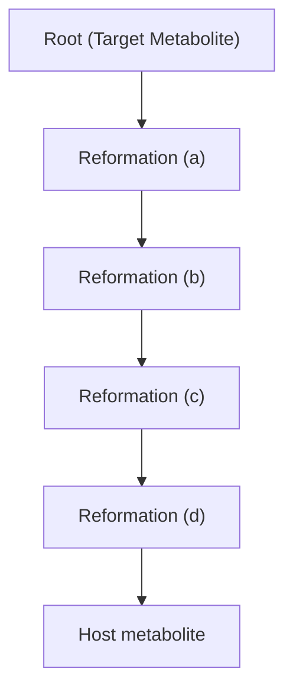
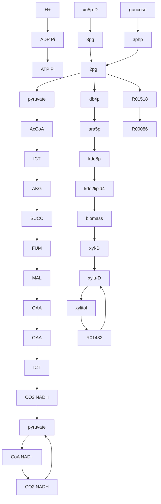
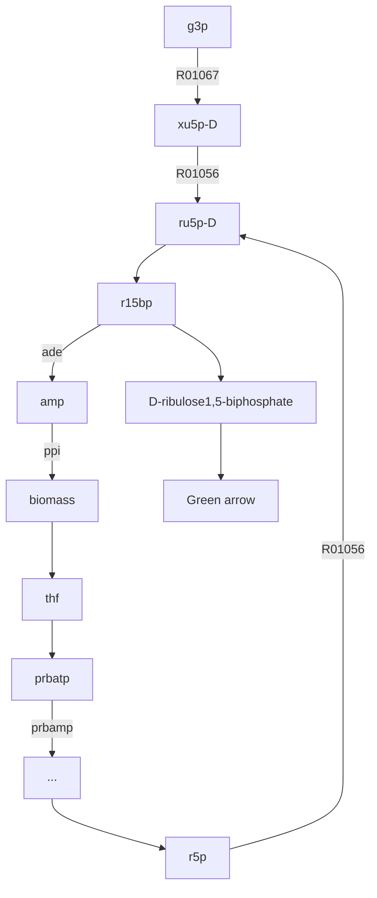
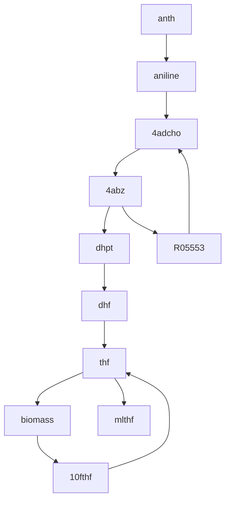

# Selection Finder (SelFi): A computational metabolic engineering tool to enable directed evolution of enzymes


CrossMark

Neda Hassanpour $^{a}$ , Ehsan Ullah $^{a}$ , Mona Yousofshahi $^{a}$ , Nikhil U. Nair $^{b}$ , Soha Hassoun $^{a,b,*}$

$^{a}$ Department of Computer Science, Tufts University, Medford, MA 02155, United States   
$^{b}$ Department of Chemical and Biological Engineering, Tufts University, Medford, MA 02155, United States

# ARTICLE INFO

Keywords:

Directed evolution of enzymes

Selection

Enzyme engineering

Flux-balance analysis

Pathway analysis

Pathway synthesis

# ABSTRACT

Directed evolution of enzymes consists of an iterative process of creating mutant libraries and choosing desired phenotypes through screening or selection until the enzymatic activity reaches a desired goal. The biggest challenge in directed enzyme evolution is identifying high-throughput screens or selections to isolate the variant(s) with the desired property. We present in this paper a computational metabolic engineering framework, Selection Finder (SelFi), to construct a selection pathway from a desired enzymatic product to a cellular host and to couple the pathway with cell survival. We applied SelFi to construct selection pathways for four enzymes and their desired enzymatic products xylitol, D-ribulose-1,5-bisphosphate, methanol, and aniline. Two of the selection pathways identified by SelFi were previously experimentally validated for engineering Xylose Reductase and RuBisCO. Importantly, SelFi advances directed evolution of enzymes as there is currently no known generalized strategies or computational techniques for identifying high-throughput selections for engineering enzymes.

# 1. Introduction

Directed evolution has emerged as a key technology to generate enzymes with new or improved properties, such as altered substrate specificity and enantioselectivity (Nair et al., 2010), thermal stability (Bastian et al., 2005; Hao and Berry, 2004; Miyazaki et al., 2006), and organic solvent resistance (Seng Wong et al., 2004; You and Arnold, 1996). A prominent example is commercially viable subtilisin, whose stability in detergent solutions was enhanced using directed evolution (Bryan, 2000). Several other such successful products include potent therapeutic agents (Vasserot et al., 2003; Kurtzman et al., 2001; Vellard, 2003), novel vaccines (Delagrave and Murphy, 2003; Marshall, 2002), and potent antibodies (Delagrave and Murphy, 2003).

Directed evolution begins by selecting a target – an enzyme with engineering potential – and a desired functional goal. An iterative process of creating mutant libraries and choosing desired phenotypes, through screens or selection, over a synthetic fitness landscape is then initiated until the goal is achieved or the desired property cannot be further improved. Significant research efforts focused on developing methodologies to create larger mutant libraries with greater functional diversity (Nair and Zhao, 2009) (e.g., tunable error-prone PCRs, saturation mutagenesis, indel mutagenesis, gene shuffling and homology-independent recombination). Currently, the biggest bottleneck in directed enzyme evolution is identifying high-throughput screens or selections to isolate the variant(s) with the desired property. While a screen links the desired property to some visual output using colorimetric or fluorometric assays, a selection links the desired property to an essential metabolic function such as host survival. Novel platforms to screen larger libraries have been aided by technologies like Fluorescence-Activated Cell Sorting (FACS) and microfluidic devices. However, these ultrahigh-throughput screening methodologies have primarily enabled engineering of non-catalytic function such as protein stability or binding affinity. Adaptation of these methods to catalytic functions has lagged far behind due to the inability to generically link any biochemical transformation to readouts like cell density or fluorescence. Hence, most directed evolution of enzymes are still largely limited by the inability to identify and implement selections or screens. This issue is widely recognized in the field (Dietrich et al., 2010; Cobb et al., 2013), yet little has been done to address this concern as a whole. Developing computational techniques to identify screens or selections can not only significantly expedite experimental practices, but also provide new opportunities to engineer enzymes whose properties are not easily linkable to screen or selection.

We present in this paper a computational metabolic engineering framework, referred to as Selection Finder (SelFi), to identify high-throughput selections to isolate active mutant enzyme with a desired

catalytic function. Given a desired enzymatic product, our framework identifies several candidate selection pathways and corresponding genetic engineering strategies for the host. The candidate pathways are then ranked based on predicted consumption flux and required cellular engineering efforts. An ideal selection provides maximum dynamic range with minimal strain engineering effort. SelFi identifies a selection pathway in four steps. In the first step, SelFi constructs traversal pathways to consume the desired enzymatic reaction product and convert it to a native metabolite within the cellular host. Utilizing a pathway construction algorithm, ProPath (Yousofshahi et al., 2011), reactions from the Kyoto Encyclopedia of Genes and Genomes (KEGG) (Kanehisa et al., 2014; Kanehisa and Goto, 2000) database are used to construct candidate consumption pathways. In the second and third steps, SelFi identifies the minimal set of carbon sources and knockout targets required to link cell survival with the consumption pathway and to guarantee a minimum flux. In the last step, SelFi ranks the resulting pathways based on flux, pathway length, and number of required knockouts. To experimentally implement the selection, the mutagenized library of the enzyme to be engineered and the identified consumption pathway along with supporting pathways must be co-expressed (using, for example, plasmids) in the selection strain with the identified knockouts. This will create a high-throughput pooled library system from which the desired enzymatic reaction will be selected. Using Escherichia coli (E. coli) as host, we applied SelFi to identify selection pathways for four enzymes (with desired reaction products) – Xylose Reductase (xylitol), Phosphoribulokinase (D-ribulose-1,5-bisphosphate), Aromatic Amino Acid Decarboxylase (aniline), and Methane Monooxygenase (methanol). Results for two pathways identified by SelFi are confirmed as valid selection schemes based on published literature. In addition, our results provide alternate strategies and potential improvements to demonstrated selection schemes.

# 2. Methods

# 2.1. Construction of consumption pathways

To identify selection pathways, we utilize a modified version of ProPath (Yousofshahi et al., 2011), a probabilistic algorithm for constructing synthesis pathways that start from a metabolite within the host and end with a desirable target. Using reactions in the KEGG database, ProPath recursively explores a tree representing all possible synthesis pathways that start from the target metabolite (Fig. 1). ProPath selects a single reaction from a list of candidate reactions in the KEGG database that involve the target metabolite as a product. Reaction selection occurs with equal likelihood of selecting a candidate reaction. The selected reaction, represented by an edge, is added to the tree. This edge expands the tree by attaching new nodes representing the product metabolites and cofactors of the selected reaction. Further pathway construction proceeds in a depth-first fashion. Each added node becomes a new root for the construction, unless the corresponding metabolite is already present in the host organism or previously added to the tree. A limit is set on the number of reactions that can be used to construct a pathway. When the addition of a reaction to the tree violates this limit, the search algorithm backtracks. The algorithm then proceeds by adding to the tree another reaction that has not been previously explored, effectively exploring an alternative pathway. If none of these alternative routes satisfy the pathway length limit, the algorithm further backtracks and continues from there. The algorithm finishes when all permitted-length branches of the tree terminate in a metabolite that is native to the host organism. Due to the probabilistic nature of selecting the reactions, the completed tree does not exhaustively enumerate all possible pathways. Rather, each tree represents a single pathway from the target metabolite to one or more metabolites that are native to the host. The search is iterated many times to explore a diverse number of possible pathways. Our route construction is based on ProPath, as it was shown effective in generating synthesis pathways with fluxes comparable with those reported for limited-in-depth exhaustive search methods. Additionally, ProPath was able to reproduce experimentally obtained pathways published in the literature. We reverse ProPath's search direction to identify a pathway starting from a compound of interest to an endogenous metabolite within the host. We refer to the use of the algorithm in this reversed manner as retroProPath. In retroProPath, the root of the tree is also the desired product of an engineered enzymatic reaction. The first set of edges added to the tree represents KEGG reactions that consume the desired enzymatic product. A single reaction among them is selected with equal likelihood to expand the tree. retroProPath continues the probabilistic search using product-side non-cofactor metabolites of the selected reaction. The in-depth path construction terminates when a metabolite within the host is reached or the path length limit is reached. The algorithm backtracks to explore a different pathway, as needed. To ensure that reactant-side cofactors associated with the identified pathway are available to the cell, SelFi utilizes ProPath to construct supporting synthesis pathways that start from a metabolite within the host and terminate at each such cofactor. The pathway from the enzymatic product to a metabolite within the host along with these supporting synthesis pathways are referred to as a consumption pathway. Other pathway synthesis methods (e.g., PathPred (Moriya et al., 2010), PathMiner (McShan et al., 2003)) can be utilized in place of ProPath.

# 2.2. Evaluating consumption pathway flux and consumption demand

Flux Balance Analysis (FBA) (Varma and Palsson, 1994) is a constraint-based approach for calculating the flow (flux) in a metabolic network under steady-state conditions. A metabolic network consists of m metabolites and n reactions. An $m \times n$ matrix, S, represents the network where each row corresponds a metabolite and each column


<details>
<summary>flowchart</summary>


</details>

Fig. 1. Probabilistic pathway construction using the ProPath algorithm (Yousofshahi et al., 2011). The dashed and solid lines show the possible routes and selected reactions, respectively. (a) Tree representing all possible synthesis pathways for a target metabolite. The root of the tree is the target metabolite. (b) and (c) only one reaction is selected at a time, in a depth-first fashion and (d) recursive exploration terminates at a metabolite within the host network.

corresponds to a stoichiometrically balanced reaction. Matrix entry $s_{i,j}$ represents the stoichiometric coefficient of metabolite i in reaction j. A vector, v, of length n, represents the flux in all network reactions. FBA uses linear programming to solve a particular cellular objective such as maximizing biomass production, or minimizing or maximizing the flux for a particular reaction. A set of equations, $S \cdot v = 0$ , constraint the system to operate in steady state. Additional constraints imposed by physiological conditions and metabolite exchange fluxes are represented as upper and lower bounds on each reaction flux.

In this work, FBA is utilized to evaluate the maximum and minimum consumption flux through the engineered enzyme, and hence through the consumption pathway. In addition, FBA is utilized to assess the consumption demand for metabolites within the host. A consumption pathway terminating at a high-demand metabolite within the host suggests the possibility of constructing a high-flux consumption pathway. A consumption pathway terminating at a low-demand metabolite explains the low yield associated with such a consumption flux.

We define the consumption demand of a metabolite as the maximum sum of all outgoing fluxes consuming the metabolite. The consumption flux of metabolite i with k consuming reactions connected to the metabolite can be calculated using FBA by solving the following optimization problem:

$$
\text { Maximize } \sum_ {j = 1} ^ {k} v _ {i j}
$$

subject to

$$
\mathbf {S} \cdot \mathbf {v} = \mathbf {0}
$$

$$
v _ {b i o} \geq v _ {b i o} ^ {m i n}
$$

$$
v _ {i j} ^ {l b} \leq v _ {i j} \leq v _ {i j} ^ {u b} \text {   for   } j = 1 \dots k
$$

where $v_{ij}$ represents the consumption flux of metabolite i through its jth consuming reaction, $v_{ij}^{lb}$ and $v_{ij}^{ub}$ are respectively the associated lower and upper bounds for $v_{ij}$ , and $v_{bio}^{min}$ represents the minimum desired biomass production rate. To identify the maximum demand while allowing for reaction reversibility, several instance problems are considered. With m reversible reactions connected to metabolite i, we consider that each reversible reaction can operate in forward and reverse directions. We then generate $2^{m}$ possible objective functions for the optimization problem, representing all possible reaction directionalities associated with the consumption flux. Using FBA, we assess consumption flux of metabolite i based on each of the objective functions for a desired biomass production rate. Among all feasible solutions obtained by FBA, we select the maximum as the consumption demand associated with metabolite i. In this work, we evaluate the consumption demand for metabolites within the cellular host. Consumption pathways that terminate on host metabolites with low consumption demand may not be suited for high-throughput selection.

# 2.3. SelFi framework

Given an engineered enzymatic reaction and its reactant and product, SelFi constructs pathways that consume the enzymatic product, and then engineers the cell to couple the consumption pathway with cell survival. SelFi has four steps – the outcomes of which are illustrated in Fig. 2.

# 2.3.1. Step 1. Constructing consumption pathways

Using retroProPath, SelFi constructs a set of possible consumption pathways from the desired product to a metabolite within the cellular host. Based on the practicality of simultaneous gene insertions, the pathway length limit is set to 20 (Galanie et al., 2015). While most cofactors required by the consumption pathways (e.g. $H^{+}$ , $O_{2}$ , $CO_{2}$ , $NAD(P)^{+}$ , $NAD(P)H$ ) are likely native to the host, SelFi constructs synthesis pathways from the host to the cofactors if needed. To do so, SelFi first determines if all reactant-side cofactors are native to the host. If a cofactor is not native, SelFi uses ProPath to construct synthesis pathways starting with a host metabolite to the cofactor. Fig. 2 shows an example pathway construction. The blue pathway is constructed using retroProPath, and provides a consumption pathway from the desired enzymatic product (green number 2) to a metabolite within the host (yellow number 1). A supporting pathway (orange) from a metabolite native to the host (yellow number 2), to a non-native cofactor on the reactant side of the reaction along the selection pathway is constructed using ProPath. While this step identifies consumption pathways, these are not yet high flux selection pathways since a link to cellular viability is not yet established. The following steps address these requirements.

# 2.3.2. Step 2. Eliminating alternate carbon sources

Selection requires linking the enzymatic product to a metabolic function essential for cell viability. This can be accomplished by forcing the consumption pathway to be the only cellular carbon source. SelFi therefore eliminates all organic carbon uptakes except for the uptake provided through the consumption pathway, and inorganic $CO_{2}$ , an essential waste product. As a cellular host, E. coli has many carbon uptakes including D-glucose, D-fructose, D-galactose, D-mannose, D-xylose, L-arabinose, D-ribose, D-glyceraldehyde, and glycerol. Typically, the cell utilizes only one such carbon source at a time for growth. Mathematically, the elimination of carbon uptake by a specific reaction can be modeled by setting its minimum and maximum operating flux to zero. In the example provided in Fig. 2, the precursor of the desired enzymatic product (green number 1) is not native to the host. Eliminating external carbon sources, marked by red “×”, couples the consumption pathway (blue) with cell survival.

In some cases, the reactant of the specified enzymatic reaction is native to the host, and limiting carbon uptake to be only through the consumption pathway is not possible. Here, an external carbon source must be provided to keep the cell alive. FBA is used to determine the external source that maximizes flux through the consumption pathway. For each carbon source, the consumption pathway flux is maximized while constraining the biomass production rate to be at least 10% production of the wild-type maximum biomass rate. Selecting a carbon source that maximizes the consumption flux does not result in coupling a consumption pathway with cell survival as the cell is not reliant on the consumption pathway. This issue is addressed in Step 3.

# 2.3.3. Step 3. Identifying knockout targets

SelFi seeks one of two goals in this step: coupling the consumption flux with cell survival, if that is not accomplished in Step 2, and improving guaranteed non-zero minimum consumption flux. SelFi can successfully couple the consumption pathway to the host survival in Step 2 except when the reactant of the given enzymatic reaction is native to the host. If the reactant is not native, survival and consumption are automatically coupled in the absence of alternate carbon sources and a minimum non-zero consumption flux is guaranteed in Step 2. Knockouts can improve this guaranteed minimum consumption flux. In presence of native reactant for the enzymatic reaction, survival-consumption coupling is not guaranteed in Step 2. In this case, SelFi searches for knockout targets in the host to guarantee non-zero minimum consumption flux to ensure the consumption pathway is linked to cell survival.

To identify possible knockout targets, SelFi utilizes a sequential greedy strategy. SelFi explores knocking out one reaction at a time using FBA to calculate the minimum flux through the consumption pathway. Among knockout targets that improve the minimum consumption flux, SelFi selects the one that improve the minimum flux the most. SelFi continues to find an additional knockout target that improves the flux, repeating this process until the maximum allowed number of knockouts, as specified by the user, is reached. In this work, we set the number of knockouts to three to limit the computational cost associated with evaluating each consumption pathway. Alper and et al.


<details>
<summary>flowchart</summary>

```mermaid
graph LR
    A["1"] -->|desired enzyme| B["2"]
    B --> C["•"]
    C --> D["•"]
    D --> E["•"]
    E --> F["1"]
    F --> G["•"]
    G --> H["•"]
    H --> I["•"]
    I --> J["•"]
    J --> K["•"]
    K --> L["•"]
    L --> M["•"]
    M --> N["•"]
    N --> O["•"]
    O --> P["•"]
    P --> Q["•"]
    Q --> R["•"]
    R --> S["•"]
    S --> T["•"]
    T --> U["•"]
    U --> V["•"]
    V --> W["•"]
    W --> X["•"]
    X --> Y["•"]
    Y --> Z["•"]
    Z --> AA["•"]
    AA --> AB["•"]
    AB --> AC["•"]
    AC --> AD["•"]
    AD --> AE["•"]
    AE --> AF["•"]
    AF --> AG["•"]
    AG --> AH["•"]
    AH --> AI["•"]
    AI --> AJ["•"]
    AJ --> AK["•"]
    AK --> AL["•"]
    AL --> AM["•"]
    AM --> AN["•"]
    AN --> AO["•"]
    AO --> AP["•"]
    AP --> AQ["•"]
    AQ --> AR["•"]
    AR --> AS["•"]
    AS --> AT["•"]
    AT --> AU["•"]
    AU --> AV["•"]
    AV --> AW["•"]
    AW --> AX["•"]
    AX --> AY["•"]
    AY --> AZ["•"]
    AZ --> BA["•"]
    BA --> BB["•"]
    BB --> BC["•"]
    BC --> BD["•"]
    BD --> BE["•"]
    BE --> BF["•"]
    BF --> BG["•"]
    BG --> BH["•"]
    BH --> BI["•"]
    BI --> BJ["•"]
    BJ --> BK["•"]
    BK --> BL["•"]
    BL --> BM["•"]
    BM --> BN["•"]
    BN --> BO["•"]
    BO --> BP["•"]
    BP --> BQ["•"]
    BQ --> BR["•"]
    BR --> BS["•"]
    BS --> BT["•"]
    BT --> BU["•"]
    BU --> BV["•"]
    BV --> BW["•"]
    BW --> BX["•"]
    BX --> BY["•"]
    BY --> BZ["•"]
    BZ --> CA["•"]
    CA --> CB["•"]
    CB --> CC["•"]
    CC --> CD["•"]
    CD --> CE["•"]
    CE --> CF["•"]
    CF --> CG["•"]
    CG --> CH["•"]
    CH --> CI["•"]
    CI --> CJ["•"]
    CJ --> CK["•"]
    CK --> CR["•"]
    CR --> CS["•"]
    CS --> CT["•"]
    CT --> CU["•"]
    CU --> CV["•"]
    CV --> CW["•"]
    CW --> CX["•"]
    CX --> CY["•"]
    CY --> CZ["•"]
    CZ --> DA["•"]
    DA --> DB["•"]
    DB --> DC["•"]
    DC --> DD["•"]
    DD --> DJ["•"]
    DJ --> DK["•"]
    DK --> DL["•"]
    DL --> DJ
    DJ --> DJ
    DJ --> DK
    style A fill:#f9f,stroke:#333
    style B fill:#f9f,stroke:#333
    style C fill:#f9f,stroke:#333
    style D fill:#f9f,stroke:#333
    style E fill:#f9f,stroke:#333
    style F fill:#f9f,stroke:#333
    style G fill:#f9f,stroke:#333
    style H fill:#f9f,stroke:#333
    style I fill:#f9f,stroke:#333
    style J fill:#f9f,stroke:#333
    style K fill:#f9f,stroke:#333
    style L fill:#f9f,stroke:#333
    style M fill:#f9f,stroke:#333
    style N fill:#f9f,stroke:#333
    style O fill:#f9f,stroke:#333
    style P fill:#f9f,stroke:#333
    style Q fill:#f9f,stroke:#333
    style R fill:#f9f,stroke:#333
    style S fill:#f9f,stroke:#333
    style T fill:#f9f,stroke:#333
    style U fill:#f9f,stroke:#333
    style V fill:#f9f,stroke:#333
    style W fill:#f9f,stroke:#333
    style X fill:#f9f,stroke:#333
    style Y fill:#f9f,stroke:#333
    style Z fill:#f9f,stroke:#333
    style AA fill:#f9f,stroke:#333
    style AB fill:#f9f,stroke:#333
    style AC fill:#f9f,stroke:#333
    style AD fill:#f9f,stroke:#333
    style AE fill:#f9f,stroke:#333
    style AF fill:#f9f,stroke:#333
    style AG fill:#f9f,stroke:#333
    style AH fill:#f9f,stroke:#333
    style AI fill:#f9f,stroke:#333
    style AJ fill:#f9f,stroke:#333
    style AK fill:#f9f,stroke:#333
    style AL fill:#f9f,stroke:#333
    style AM fill:#f9f,stroke:#333
    style AN fill:#f9f,stroke:#333
    style AO fill:#f9f,stroke:#333
    style AP fill:#f9f,stroke:#333
    style AQ fill:#f9f,stroke:#333
    style AR fill:#f9f,stroke:#333
    style AS fill:#f9f,stroke:#333
    style AT fill:#f9f,stroke:#333
    style AU fill:#f9f,stroke:#333
    style AV fill:#f9f,stroke:#333
    style AW fill:#f9f,stroke:#333
    style AX fill:#f9f,stroke:#333
    style AY fill:#f9f,stroke:#333
    style AZ fill:#f9f,stroke:#333
    style BA fill:#f9f,stroke:#333
    style BB fill:#f9f,stroke:#333
    style BC fill:#f9f,stroke:#333
    style BD fill:#f9f,stroke:#333
    style BE fill:#f9f,stroke:#333
    style BF fill:#f9f,stroke:#333
    style BG fill:#f9f,stroke:#333
    style BH fill:#f9f,stroke:#333
    style BI fill:#f9f,stroke:#333
    style BJ fill:#f9f,stroke:#333
    style BK fill:#f9f,stroke:#333
    style BL fill:#f9f,stroke:#333
    style BM fill:#f9f,stroke:#333
    style BN fill:#f9f,stroke:#333
    style BO fill:#f9f,stroke:#333
    style BP fill:#f9f,stroke:#333
    style BQ fill:#f9f,stroke:#333
    style CA fill:#f9f,stroke:#333
    style CB fill:#f9f,stroke:#333
    style CC fill:#f9f,stroke:#333
    style DD fill:#f9f,stroke:#333
    style EY fill:#f9f,stroke:#333
    style ZY fill:#f9f,stroke:#333
    style AAY fill:#f9f,stroke:#333
    style ABZ fill:#f9f,stroke:#333
    style ACY fill:#f9f,stroke:#333
    style ADZ fill:#f9f,stroke:#333
    style AEY fill:#f9f,stroke:#333
    style AFZ fill:#f9f,stroke:#333
    style AGY fill:#f9f,stroke:#333
    style AHZ fill:#f9f,stroke:#333
    style AIY fill:#f9f,stroke:#333
    style AJY fill:#f9f,stroke:#333
    style AKY fill:#f9f,stroke:#333
    style ALY fill:#f9f,stroke:#333
    style AMY fill:#f9f,stroke:#333
    style ANY fill:#f9f,stroke:#333
    style AOY fill:#f9f,stroke:#333
    style APY fill:#f9f,stroke:#333
    style AQY fill:#f9f,stroke:#333
    style ARY fill:#f9f,stroke:#333
    style ASY fill:#f9f,stroke:#333
    style ATY fill:#f9f,stroke:#333
    style AUY fill:#f9f,stroke:#333
    style AVY fill:#f9f,stroke:#333
    style AWY fill:#f9f,stroke:#333
    style AXY fill:#f9f,stroke:#333
    style AYZ fill:#f9f,stroke:#333
    style AZY fill:#f9f,stroke:#333
    style BAY fill:#f9f,stroke:#333
    style BBY fill:#f9f,stroke:#333
    style BCY fill:#f9f,stroke:#333
    style ADY fill:#f9f,stroke:#333
    style AEY fill:#f9f,stroke:#333
    style AFY fill:#f9f,stroke:#333
    style AGY fill:#f9f,stroke:#333
    style AHY fill:#f9f,stroke:#333
    style AIY fill:#f9f,stroke:#333
    style AJY fill:#f9f,stroke:#333
    style AKY fill:#f9f,stroke:#333
    style ALY fill:#f9f,stroke:#333
    style AMY fill:#f9f,stroke:#333
    style ANY fill:#f0f,stroke:#333
    style AOY fill:#f0f,stroke:#333
    style APY fill:#f0f,stroke:#333
    style AQY fill:#f0f,stroke:#333
    style ARY fill:#f0f,stroke:#333
    style ASY fill:#f0f,stroke:#333
    style ATY fill:#f0f,stroke:#333
    style AUY fill:#f0f,stroke:#333
    style AVY fill:#f0f,stroke:#333
    style AWY fill:#f0f,stroke:#333
    style AXY fill:#f0f,stroke:#333
    style AYZ fill:#f0f,stroke:#333
    style AZY fill:#f0f,stroke:#333
    style ADY fill:#f0f,stroke:#333
    style AEY fill:#f0f,stroke:#333
    style AFY fill:#f0f,stroke:#333
    style AGY fill:#f0f,stroke:#333
    style AHY fill:#f0f,stroke:#333
    style AIY fill:#f0f,stroke:#333
    style AJY fill:#f0f,stroke:#333
    style AKY fill:#f0f,stroke:#333
    style ALY fill:#f0f,stroke:#333
    style AMY fill:#f0f,stroke:#333
    style ANY fill:#f0f,stroke:#333
    style AOY fill:#f0f,stroke:#333
    style APY fill:#f0f,stroke:#333
    style AQY fill:#f0f,stroke:#333
    style ARY fill:#f0f,stroke:#333
    style ASY fill:#f0f,stroke#333
    style ATY fill:#f0f,stroke:#333
    style AUY fill:#f0f,stroke:#333
    style AVY fill:#f0f,stroke:#333
    style AWY fill:#f0f,stroke:#333
    style AXY fill:#f0f,stroke:#333
    style AZY fill:#f0f,stroke:#333
    style ADY fill:#f0f,stroke:#333
    style AEY fill:#f0f,stroke:#333
    style AFY fill:#f0f,stroke:#333
    style AGY fill:#f0f,stroke:#333
    style AHY fill:#f9f,stroke:#333
    style AIY fill:#f9f,stroke:#333
    style AJY fill:#f9f,stroke:#333
    style AKY fill:#f9f,stroke:#333
    style ALY fill:#f9f,stroke:#333
    style AMY fill:#f9f,stroke#333
    style ANY fill:#f9f,stroke:#333
    style AOY fill:#f9f,stroke:#333
    style APY fill:#f9f,stroke:#333
    style AVY fill:#f9f,stroke:#333
    style AWY fill:#f9f,stroke:#333
    style AXY fill:#f9f,stroke:#333
    style AYZ fill:#f9f,stroke:#333
    style ADY fill:#f9f,stroke:#333
    style AEY fill:#f9f,stroke:#333
    style AFY fill:#f9f,stroke:#333
    style AHY fill:#f9f,stroke:#333
    style AIY fill:#f9f,stroke:#333
    style AJY fill:#f9f,stroke:#333
    style AKY fill:#f9f,stroke:#333
    style ALY fill:#f9f,stroke:#333
    style AMY fill:#9f9,stroke:#333
    style ANY fill:#9f9,stroke:#333
    style AOY fill:#9f9,stroke:#333
    style APY fill:#9f9,stroke:#333
    style AVY fill:#9f9,stroke:#333
    style AWY fill:#9f9,stroke:#333
    style AXY fill:#9f9,stroke:#333
    style AYZ fill:#9f9,stroke:#333
    style ADY fill:#9f9,stroke:#333
    style AEY fill:#9f9,stroke:#333
    style AFY fill:#9f9,stroke:#333
    style AHY fill:#9f9,stroke:#333
    style AIY fill:#9f9,stroke:#333
    style AJY fill:#9f9,stroke:#333
    style AKY fill:#9f9,stroke:#333
    style ALY fill:#9f9,stroke:#333
    style AMY fill:#9f9,stroke:#333
    style ANY fill:#9f9,stroke:#333
    style AOY fill:#9f9,stroke:#333
    style APY fill:#9f9,stroke:#333
    style AVY fill:#9f9,stroke:#333
    style AWY fill:#9f9,stroke:#000
    style AXY fill:#9f9,stroke:#333
    style AYZ fill:#9f9,stroke:#333
    style ADY fill:#9f9,stroke:#333
    style AEY fill:#9f9,stroke:#333
    style AFY fill:#9f9,stroke:#333
    style AHY fill:#9f9,stroke:#333
    note1["desired enzyme"] --> A
    note2["desired enzymatic product"] --> A
    note3["host"] --> A
    note4["carbon sources"] --> A
    note5["biomass"] --> A
    note6["host"] --> A
    note7["host"] --> A
    note8["host"] --> A
    note9["host"] --> A
    note10["host"] --> A
    note11["host"] --> A
    note12["host"] --> A
    note13["host"] --> A
    note14["host"] --> A
    note15["host"] --> A
    note16["host"] --> A
    note17["host"] --> A
    note18["host"] --> A
    note19["host"] --> A
    note20["host"] --> A
    note21["host"] --> A
    note22["host"] --> A
    note23["host"] --> A
    note24["host"] --> A
    note25["host"] --> A
    note26["host"] --> A
    note27["host"] --> A
    note28["host"] --> A
    note29["host"] --> A
    note30["host"] --> A
    note31["host"] --> A
    note32["host"] --> A
    note33["host"] --> A
    note34["host"] --> A
    note35["host"] --> A
    note36["host"] --> A
    note37["host"] --> A
    note38["host"] --> A
    note39["host"] --> A
    note40["host"] --> A
    note41["host"] --> A
    note42["host"] --> A
    note43["host"] --> A
    note44["host"] --> A
    note45["host"] --> A
    note46["host"] --> A
    note47["host"] --> A
    note48["host"] --> A
    note49["host"] --> A
    note50["host"] --> A
    note51["host"] --> A
    note52["host"] --> A
    note53["host"] --> A
    note54["host"] --> A
    note55["host"] --> A
    note56["host"] --> A
    note57["host"] --> A
    note58["host"] --> A
    note59["host"] --> A
    note60["host"] --> A
    note61["host"] --> A
    note62["host"] --> A
    note63["host"] --> A
    note64["host"] --> A
    note65["host"] --> A
    note66["host"] --> A
    note67["host"] --> A
    note68["host"] --> A
    note69["host"] --> A
    note70["host"] --> A
    note71["host"] --> A
    note72["host"] --> A
    note73["host"] --> A
    note74["host"] --> A
    note75["host"] --> A
    note76["host"] --> A
    note77["host"] --> A
    note78["host"] --> A
    note79["host"] --> A
    note80["host"] --> A
    note81["host"] --> A
    note82["host"] --> A
    note83["host"] --> A
    note84["host"] --> A
    note85["host"] --> A
    note86["host"] --> A
    note87["host"] --> A
    note88["host"] --> A
    note89["host"] --> A
    note90["host"] --> A
    note91["host"] --> A
    note92["host"] --> A
    note93["host"] --> A
    note94["host"] --> A
    note95["host"] --> A
    note96["host"] --> A
    note97["host"] --> A
    note98["host"] --> A
    note99["host"] --> A
    note100["host"] --> A
```
</details>

Fig. 2. Illustration of SelFi implementation. The large round circle indicates boundaries of the wild-type E. coli, and the dotted box indicates boundaries of the cell after co-expression of the selection system. The desired enzyme catalyzes a reactant (green number 1) to a desired product (green number 2). A consumption pathway (blue) from the desired product to a metabolite (yellow number 1) within the wild-type E. coli is constructed using retroProPath to consume the desired product. A supporting pathway (orange) from a native metabolite (yellow number 2) in the wild type to a cofactor on the reactant side of a consumption pathway is constructed using ProPath, if needed. An “x” within the cell indicates a knockout, and an “x” outside the cell indicates eliminating carbon sources. (For interpretation of the references to color in this figure legend, the reader is referred to the web version of this article).

used a similar greedy knockout strategy to maximize the production of lycopene in E. coli (Alper et al., 2005).

# 2.3.4. Step 4. Ranking selection pathways

For each pathway identified by Steps 1–3, SelFi generates a listing of reactions in the selection pathway and their corresponding supporting pathways needed to generate co-factors. SelFi reports the total number of steps in both the selection and support pathways, and the computed guaranteed minimum and maximum consumption fluxes before and after knockouts. SelFi provides all information such that the end user can explore various options. Ideally, candidate pathways are chosen based on the guaranteed minimum consumption flux, pathway length, and number of required knockouts. Shorter, higher-consumption flux pathways with the smallest number of knockouts are preferable over others.

# 3. Results

To analyze the effectiveness of our algorithm, we applied SelFi to several test cases including desired products xylitol, D-ribulose-1,5-bisphosphate, methanol, and aniline that can be potentially synthesized through the action of engineered enzymes Xylose Reductase (XR), Phosphoribulokinase (PRK), Methane Monooxygenase (MMO), and Aromatic Amino acid Decarboxylase (AAD), respectively. We utilized the genome-scale model of E. coli metabolism (iAF1260) (Feist et al., 2007) as the host organism. The iAF1260 model constraints were modified as follows. A constraint is added to ensure that the biomass flux is equal to or greater than 10% of the maximum biomass flux rate of the wild type. The lower and upper bounds on oxygen uptake were set to -1000 and 1000 (mmol/gDCW/h) respectively to allow for aerobic growth conditions. The lower and upper flux bounds for the engineered enzymatic reaction were set to 0 and 1000 (mmol/gDCW/h) respectively. Lower and upper flux bounds of reactions along the added selection pathways were set to -1000 and 1000 (mmol/gDCW/h), respectively.

# 3.1. Summary of results

We executed retroProPath for 1000 iterations. Selection pathways identified by SelFi (after Step 1) are summarized in Table 1. The first column lists the product of the enzymatic reaction. The second column lists a label we assigned to each selection pathway. The first letter of the subscript indicates the product (X for xylitol, D for D-ribulose-1,5-bisphosphate, M for methanol, and A for aniline), while the second letter indicates the selection pathway number. The third column lists the reactions along identified selection pathways. All cofactors along the pathways are native to the host, thus eliminating the need for adding synthesis pathways for reactant-side cofactors.

Table 2 summarizes flux characterization results after restricting carbon uptakes (after Step 2), and after knockouts (after Step 3). The first column lists the selection pathways by their labels as designated in Table 1. The second column lists the length of the pathways. The third and fourth columns list minimum and maximum consumption fluxes before applying any knockouts. In many cases, the minimum consumption flux is zero, indicating that the added consumption pathway is not essential for growth, and that the host must be engineered through knockouts to couple the consumption pathway with cell survival. The fifth column lists the number of knockouts identified to improve minimum consumption fluxes. The two last columns show minimum and maximum consumption fluxes after applying knockouts. In this work, the knockouts were selected to provide a minimal guaranteed flux. In each case, after knockouts, the minimum consumption flux increases whereas the maximum consumption flux decreases. A higher minimum uptake rate will enable selection for mutants with higher activity. Conversely, a lower minimum guaranteed uptake rate will provide a less stringent selection, and for identification of mutants with lower activity. Thus, the knockout process provides a mechanism to place a threshold on minimum desired enzymatic activity. Table 3 summarizes the consumption demand for metabolites terminating the selection pathways identified by SelFi. The first column lists the pathway label, while the second column lists the terminating metabolite. The following columns report the consumption fluxes calculated using FBA assuming various desired lower bounds on biomass production, expressed as a percentage of the maximum biomass production in the wild type. For each end metabolite except for L-arabinose, the consumption demand remains constant assuming 10–70% minimal biomass production. L-arabinose drops to 1750 mmol/gDCW/h when assuming 70% or higher minimal biomass production, while 3-dehydro-L-gulonate, D-ribose 1,5-bisphosphate, formaldehyde and 4-aminobenzoate show no change across the 10–90% minimal biomass production range. All consumption demands are relatively high except for two end metabolites. 3-dehydro-L-gulonate is produced from 2 to 3-dioxo-L-gulonate, a metabolite that is not produced by any other reaction in the model. The consumption demand for 3-dehydro-L-gulonate is thus zero. If 2–3-dioxo-L-gulonate is supplied to the cell with an uptake rate of 1000 mmol/gDCW/h, the consumption demand for 3-dehydro-L-gulonate becomes 1000 mmol/gDCW/h assuming 10–70% minimal biomass production, and 333 mmol/gDCW/h assuming 90% minimal biomass production. In contrast, metabolite 4-aminobenzoate has low demand and can only be utilized in relatively small quantities for biomass production.

# 3.2. Xylose Reductase (XR) and xylitol

Xylitol is used as a low-calorie sweetener or platform chemical for the production of industrially important chemicals such as glycols

Table 1
Description of identified selection pathways for enzymatic products xylitol, D-ribulose-1,5-bisphosphate, methanol, and aniline. 

<table><tr><td>Desired product</td><td>Selection pathway label</td><td>Consumption pathway</td></tr><tr><td colspan="3">For engineering Xylose Reductase</td></tr><tr><td>Xylitol</td><td> $SP_{X1}$ </td><td>xylitol+NAD+↔D-xylulose+NADH+H+</td></tr><tr><td>Xylitol</td><td> $SP_{X2}$ </td><td>xylitol+NAD(P)+↔L-xylulose+NAD(P)H+H+L-xylulose+NADH+H+↔L-arabitol+NAD+L-arabitol+NAD(P)+↔L-arabinose+NAD(P)H+H+</td></tr><tr><td>Xylitol</td><td> $SP_{X3}$ </td><td>xylitol+NAD(P)+↔L-xylulose+NAD(P)H+H+ATP+L-xylulose↔ADP+L-xylulose 5-phosphate</td></tr><tr><td>Xylitol</td><td> $SP_{X4}$ </td><td>xylitol+NAD(P)+↔L-xylulose+NAD(P)H+H+L-xylulose+NADH+H+↔L-arabitol+NAD+L-arabitol+NAD+↔L-ribulose+NADH+H+</td></tr><tr><td>Xylitol</td><td> $SP_{X5}$ </td><td>xylitol+NAD(P)+↔L-xylulose+NAD(P)H+H+L-xylulose↔L-lyxose</td></tr><tr><td>Xylitol</td><td> $SP_{X6}$ </td><td>xylitol+NAD(P)+↔L-xylulose+NAD(P)H+H+L-xylulose+CO2↔3-dehydro-L-gulonate</td></tr><tr><td>Xylitol</td><td> $SP_{X7}$ </td><td>xylitol+NAD(P)+↔L-xylulose+NAD(P)H+H+ATP+L-xylulose↔ADP+L-xylulose 1-phosphateL-xylulose 1-phosphate↔glycerone phosphate+glycolaldehyde</td></tr><tr><td colspan="3">For engineering Phosphoribulokinase</td></tr><tr><td>D-ribulose-1,5-bisphosphate</td><td> $SP_{D1}$ </td><td>D-ribulose-1,5-bisphosphate↔D-ribose 1,5-bisphosphate</td></tr><tr><td>D-ribulose-1,5-bisphosphate</td><td> $SP_{D2}$ </td><td>D-ribulose-1,5-bisphosphate+CO2+H2O↔2 3-phospho-D-glycerate</td></tr><tr><td>D-ribulose-1,5-bisphosphate</td><td> $SP_{D3}$ </td><td>D-ribulose-1,5-bisphosphate+O2↔3-phospho-D-glycerate+2-phosphoglycolate</td></tr><tr><td colspan="3">For engineering Methane Monooxygenase</td></tr><tr><td>Methanol</td><td> $SP_{M1}$ </td><td>methanol+NAD+↔formaldehyde +NADH+H+</td></tr><tr><td>Methanol</td><td> $SP_{M2}$ </td><td>methanol+formate↔2 formaldehyde+H2O</td></tr><tr><td>Methanol</td><td> $SP_{M3}$ </td><td>methanol+O2↔formaldehyde+H2O2</td></tr><tr><td>Methanol</td><td> $SP_{M4}$ </td><td>methanol+H2O2↔formaldehyde+2H2O</td></tr><tr><td colspan="3">For engineering Aromatic Amino Acid Decarboxylase</td></tr><tr><td>Aniline</td><td> $SP_A$ </td><td>aniline+CO2↔4-aminobenzoate</td></tr></table>

Table 2 Characterizing consumption pathways, showing length of the pathways, minimum and maximum consumption fluxes before applying knockouts, number of identified knockouts and minimum and maximum consumption fluxes after knockouts, for each selection pathway. 

<table><tr><td>Selection pathway label</td><td>Pathway length</td><td>Minimum consumption flux before knockouts (mmol/gDCW/h)</td><td>Maximum consumption flux before knockouts (mmol/gDCW/h)</td><td>Number of identified knockouts</td><td>Minimum consumption flux after knockouts (mmol/gDCW/h)</td><td>Maximum consumption flux after knockouts (mmol/gDCW/h)</td></tr><tr><td> $SP_{X1}$ </td><td>1</td><td>0</td><td>1000</td><td>3</td><td>111.66</td><td>184.09</td></tr><tr><td> $SP_{X2}$ </td><td>3</td><td>0</td><td>325</td><td>3</td><td>111.66</td><td>184.09</td></tr><tr><td> $SP_{X3}$ </td><td>2</td><td>0</td><td>325</td><td>3</td><td>111.66</td><td>184.09</td></tr><tr><td> $SP_{X4}$ </td><td>3</td><td>0</td><td>325</td><td>3</td><td>111.66</td><td>184.09</td></tr><tr><td> $SP_{X5}$ </td><td>2</td><td>0</td><td>325</td><td>3</td><td>111.66</td><td>184.09</td></tr><tr><td> $SP_{X6}$ </td><td>2</td><td>0</td><td>325</td><td>3</td><td>111.66</td><td>184.09</td></tr><tr><td> $SP_{X7}$ </td><td>3</td><td>0</td><td>325</td><td>3</td><td>110.27</td><td>184.46</td></tr><tr><td> $SP_{D1}$ </td><td>1</td><td>0</td><td>1000</td><td>2</td><td>4.23</td><td>623.34</td></tr><tr><td> $SP_{D2}$ </td><td>1</td><td>0</td><td>847.04</td><td>1</td><td>3.78</td><td>689.08</td></tr><tr><td> $SP_{D3}$ </td><td>1</td><td>0</td><td>615.66</td><td>1</td><td>3.55</td><td>500.58</td></tr><tr><td> $SP_{M1}$ </td><td>1</td><td>44.53</td><td>726.79</td><td>3</td><td>117.50</td><td>673.76</td></tr><tr><td> $SP_{M2}$ </td><td>1</td><td>47.01</td><td>500</td><td>3</td><td>127.29</td><td>500</td></tr><tr><td> $SP_{M3}$ </td><td>1</td><td>60.28</td><td>510.44</td><td>1</td><td>196.18</td><td>502.40</td></tr><tr><td> $SP_{M4}$ </td><td>1</td><td>60.38</td><td>515.84</td><td>2</td><td>278.59</td><td>502.70</td></tr><tr><td> $SP_A$ </td><td>1</td><td>0</td><td>0.01</td><td>1</td><td>0.001</td><td>0.01</td></tr></table>

(Werpy and Petersen, 2004). Xylitol can be overproduced through an engineered XR enzyme (Fig. 3) with D-xylose as a reactant and desired enzymatic product xylitol (Nair and Zhao, 2008). The purpose of engineered XR, as described by Nair and Zhao (2008), is to engineer substrate specificity of XR while maintaining its activity toward the natural substrate, D-xylose.

SelFi identified seven consumption pathways for xylitol as specified in Tables 1 and 2. The pathways end with D-xylulose, L-arabitol, L-xylulose 5-phosphate, L-ribulose, L-lyxose, 3-dehydro-L-gulonate, and glycolaldehyde. D-xylose, the reactant of the enzymatic reaction, is native to E. coli. SelFi limited all external carbon sources except for D-xylose. All terminating metabolites have relatively high demand, as per Table 3, except for 3-dehydro-L-gulonate. However, with D-xylose uptake, xylitol is converted to L-xylulose, which in turn is converted

to 3-dehydro-L-gulonate, and a maximum consumption flux of 325 mmol/gDCW/h can be achieved prior to knockouts.

SelFi identified the same set of three knockout targets for selection pathways $SP_{X1} - SP_{X7}$ . As shown in Table 2, the minimum flux through the consumption pathways, which is zero mmol/gDCW/h prior to applying any knockouts, is 110.27 mmol/gDCW/h or higher after knockouts. The knockouts thus result in coupling the consumption pathway with cellular growth. Table 4 summarizes reactions identified by SelFi as knockout targets and their corresponding KEGG identification numbers (KEGG IDs). Table 5 presents the order of reactions to be knocked out and shows the extent to which each knockout improves the guaranteed minimum consumption flux. The knockout targets identified by SelFi are shown in Fig. 4, where a solid arrow illustrates a single reaction, while a dashed line represents multiple reaction steps.

Table 3
Consumption demand flux of end metabolites in mmol/gDCW/h for each selection pathway, assuming a minimum of 10%, 30%, 50%, 70%, and 90% biomass production compared to the maximum biomass production of the wild type. 

<table><tr><td rowspan="2">Pathway</td><td rowspan="2">End metabolite in host</td><td colspan="5">Minimum biomass production rate</td></tr><tr><td>10%</td><td>30%</td><td>50%</td><td>70%</td><td>90%</td></tr><tr><td> $SP_{X1}$ </td><td>D-xylulose</td><td>1000.00</td><td>1000.00</td><td>1000.00</td><td>1000.00</td><td>500.00</td></tr><tr><td> $SP_{X2}$ </td><td>L-arabinose</td><td>2000.00</td><td>2000.00</td><td>2000.00</td><td>1750.00</td><td>1250.00</td></tr><tr><td> $SP_{X3}$ </td><td>L-xylulose 5-phosphate</td><td>1000.00</td><td>1000.00</td><td>1000.00</td><td>1000.00</td><td>500.00</td></tr><tr><td> $SP_{X4}$ </td><td>L-ribulose</td><td>1000.00</td><td>1000.00</td><td>1000.00</td><td>1000.00</td><td>500.00</td></tr><tr><td> $SP_{X5}$ </td><td>L-lyxose</td><td>1000.00</td><td>1000.00</td><td>1000.00</td><td>1000.00</td><td>500.00</td></tr><tr><td> $SP_{X6}$ </td><td>3-dehydro-L-gulonate</td><td>0.00</td><td>0.00</td><td>0.00</td><td>0.00</td><td>0.00</td></tr><tr><td> $SP_{X7}$ </td><td>glycolaldehyde</td><td>1000.00</td><td>1000.00</td><td>1000.00</td><td>1000.00</td><td>500.33</td></tr><tr><td> $SP_{D1}$ </td><td>D-ribose 1,5-bisphosphate</td><td>1000.00</td><td>1000.00</td><td>1000.00</td><td>1000.00</td><td>1000.00</td></tr><tr><td> $SP_{D2-3}$ </td><td>3-phospho-D-glycerate</td><td>2000.00</td><td>2000.00</td><td>2000.00</td><td>2000.00</td><td>1500.00</td></tr><tr><td> $SP_{M1-4}$ </td><td>formaldehyde</td><td>1000.00</td><td>1000.00</td><td>1000.00</td><td>1000.00</td><td>1000.00</td></tr><tr><td> $SPA$ </td><td>4-aminobenzoate</td><td>0.05</td><td>0.05</td><td>0.05</td><td>0.05</td><td>0.05</td></tr></table>

Metabolites and reactions native to the host are enclosed in a box, while non-native ones are placed outside the box. The remaining figures utilize the same drawing convention. The complete names of abbreviations used in Fig. 4 (and Figs. 6 and 7) are listed in the Supplementary file named Abbreviations Table. The first knockout target R01432 is a reaction that consumes D-xylose (xyl-D) as its reactant. Knocking out this reaction provides larger amount of D-xylose to be catalyzed by the engineered enzyme, XR, providing more xylitol to the host. The second identified knockout target, R00086, is adenosine triphosphate (ATP) synthesis reaction. With this knockout, the host is unable to efficiently synthesize ATP via oxidative phosphorylation and is consequently forced to use more substrate xylitol for generating ATP via the less-efficient substrate-level phosphorylation, increasing total xylitol demand for equivalent biomass production. The third identified knockout target, R01518, is a reaction with reactant 3-phospho-D-glycerate (3 pg) and product D-glycerate-2-phosphate (2 pg). As shown in Fig. 4, knocking out this reaction diverts flux towards D-ribulose-5-phosphate (ru5p-D), which is involved in the production of biomass precursors. Higher production rates of ru5p-D places demand for more substrate D-xylulose-5-phosphate (xu5p-D), which results in higher demand for xylitol, and thus a higher consumption flux.

Among the identified selection pathways, $SP_{X1}$ , is the shortest pathway with length one. This pathway provides a guaranteed minimum consumption flux equal to 111.66 mmol/gDCW/h after applying the identified knockouts. Nair and Zhao (Nair and Zhao, 2008) used the same selection pathway to engineer XR but only applied the first identified knockout target, R01432, to guarantee a minimum consumption flux. SelFi identified two additional knockout targets to improve the selection and more strongly link growth rate to engineered XR activity.

# 3.3. Phosphoribulokinase (PRK) and D-Ribulose-1,5-bisphosphate

Photosynthetic $CO_{2}$ fixation is a source of organic carbon and necessary for carbon sequestration. PRK catalyzes a reaction to

Table 4 Knockout targets for xylitol test case. 

<table><tr><td>Knockout target reaction</td><td>KEGG ID</td></tr><tr><td>D-xylose[c]a↔D-xylulose[c]</td><td>R01432</td></tr><tr><td>ADP[c]+4.0H+[p]b+Pi[c]↔ATP[c]+H2O[c]+3.0H+[c]</td><td>R00086</td></tr><tr><td>D-glycerate-2-phosphate[c]↔3-phospho-D-glycerate[c]</td><td>R01518</td></tr></table>

$^{a}$ Cytoplasmic localization.

$^{b}$ Periplasmic localization. establish the photosynthetic $CO_{2}$ fixation with D-ribulose-5-phosphate as a reactant and D-ribulose-1,5-bisphosphate as a product (Cai et al.,

Table 5
Effect of knockouts to improve guaranteed minimum consumption fluxes. For each pathway listed in column 1, we identify knockout targets, and the corresponding minimum guaranteed flux in parenthesis. 

<table><tr><td>Selection pathway label</td><td>1st Round</td><td>2nd Round</td><td>3rd Round</td></tr><tr><td> $\text{SP}_{\text{X1-X6}}$ </td><td> $\Delta \text{R01432}$ (21.80)</td><td> $\Delta \text{R01432, } \Delta$ R00086 (57.66)</td><td> $\Delta \text{R01432, } \Delta \text{R00086, } \Delta \text{R01518 (111.66)}$ </td></tr><tr><td> $\text{SP}_{\text{X7}}$ </td><td> $\Delta \text{R01432}$ (21.80)</td><td> $\Delta \text{R01432, } \Delta$ R00086 (57.66)</td><td> $\Delta \text{R01432, } \Delta \text{R00086, } \Delta \text{R01518 (110.27)}$ </td></tr></table>


<details>
<summary>flowchart</summary>


</details>

Fig. 4. R01432, R00086 and R01518 are knockout targets (shown in red). The engineered enzymatic reaction is colored in green. Knockouts improve the production of xylitol from xyl-D through the engineered enzymatic reaction. (For interpretation of the references to color in this figure legend, the reader is referred to the web version of this article).


<details>
<summary>chemical</summary>

Chemical reaction diagram showing D-xylose reacting with XR to form xylitol and NAD(P)+
</details>

Fig. 3. Reduction of D-xylose to xylitol by Xylose Reductase (XR).

Table 6
Knockout targets for D-ribulose-1,5-bisphosphate test case. 

<table><tr><td>Knockout target reaction</td><td>KEGG ID</td></tr><tr><td>D-ribulose-5-phosphate[c]↔D-ribose-5-phosphate[c]</td><td>R01056</td></tr><tr><td>D-erythrose-4-phosphate[c]+D-xylulose-5-phosphate[c]↔D-fructose-6-phosphate[c]+glyceraldehyde-3-phosphate[c]</td><td>R01067</td></tr></table>

2014). The reactant of this enzymatic reaction, D-ribulose-5-phosphate, is native to the host.

SelFi identified three consumption pathways as shown in Tables 1 and 2 for D-ribulose-1,5-bisphosphate. The consumption pathways end at D-ribose 1,5-bisphosphate, 3-phospho-D-glycerate, or 2-phosphoglycolate. SelFi restricts all external carbon sources except glycerol. Knockout targets that improve the minimum flux through the consumption pathways are summarized in Table 6. Table 7 presents the order of reactions to knock out and shows the extent to which each knockout improves the guaranteed minimum consumption flux of D-ribulose-1,5-bisphosphate. For selection pathway $SP_{D1}$ , SelFi identified two knockout targets, while only one knockout target was identified for pathways $SP_{D2}$ and $SP_{D3}$ . Additional knockouts did not further improve the flux through the consumption pathways.

Red-labeled reactions in Fig. 5 indicate knockout targets for the production of D-ribulose-1,5-bisphosphate through the engineered enzymatic reaction, which is colored in green. The first knockout target, R01056, is a reaction that consumes D-ribulose-5-phosphate (ru5p-D), the reactant of the enzymatic reaction. Knocking out this reaction provides larger amounts of ru5p-D for the engineered PRK leading to higher production of D-ribulose-1,5-bisphosphate. The second knockout target, R01067, similarly affects the host as R01067 is part of a pathway consuming ru5p-D.

The selection pathway $SP_{D1}$ provides the highest guaranteed minimum flux, 4.23 mmol/gDCW/h, after applying two knockouts. Among the identified pathways, the pathway from D-ribulose-1,5-bisphosphate to 3-phospho-D-glycerate was previously experimentally validated and confirmed in literature by Cai et al. (2014), but used for selection of a different enzyme – RuBisCO. Since PRK and RuBisCO catalyze sequential reactions in $CO_{2}$ fixation, Cai et al. coupled both reactions to implement their selection.

# 3.4. Methane Monooxygenase (MMO) and methanol

Conversion of methane to a liquid fuel such as methanol is highly desirable. While this conversion can be catalyzed by the enzyme MMO (Basch et al., 1999), Chen et al. have shown that a cytochrome P450 oxidase can also be engineered to catalyze this reaction (Chen et al., 2012).

SelFi identified four consumption pathways for the methanol test case as shown in Tables 1 and 2. All identified pathways terminate at formaldehyde, but utilize different co-substrates and cofactors. Selection pathways $SP_{M1}$ and $SP_{M2}$ use $NAD^{+}/NADH$ cofactors, while

Table 7
Effect of knockouts to improve guaranteed minimum consumption fluxes. For each pathway listed in column 1, we identify knockout targets, and the corresponding minimum guaranteed flux in parenthesis. 

<table><tr><td>Selection pathway label</td><td>1st Round</td><td>2nd Round</td><td>3rd Round</td></tr><tr><td> $\text{SP}_{\text{D1}}$ </td><td> $\Delta \text{R01056}$ (2.37)</td><td> $\Delta \text{R01056, } \Delta \text{R01067(4.23)}$ </td><td> $_{\text{a}}$ </td></tr><tr><td> $\text{SP}_{\text{D2}}$ </td><td> $\Delta \text{R01056}$ (3.78)</td><td> $_{\text{a}}$ </td><td> $_{\text{a}}$ </td></tr><tr><td> $\text{SP}_{\text{D3}}$ </td><td> $\Delta \text{R01056}$ (3.55)</td><td> $_{\text{a}}$ </td><td> $_{\text{a}}$ </td></tr></table>

$^{a}$ No further flux-improving knockouts are identified.

selection pathways $SP_{M3}$ and $SP_{M4}$ utilize $H_{2}O_{2}$ and $O_{2}$ , respectively. The reactant of the enzymatic reaction, methane, is not native to the host. Upon restricting all external carbon sources except for methane, the identified consumption pathways became coupled with host survival enabling non-zero minimum consumption fluxes shown in Table 2. In this case, knockouts function solely to improve the non-zero minimum consumption fluxes. Table 8 shows reactions and their corresponding KEGG IDs as knockout targets. Table 9 shows the order of reactions to knock out as determined by SelFi, and the effect of each knockout has in improving the guaranteed minimum consumption fluxes.

Fig. 6 illustrates the knockout targets in red. The first knockout target, R00345, produces oxaloacetate, a metabolite involved in TCA cycle. The next identified knockout, R09504, is the cytochrome oxidase reaction, which is coupled with ATP synthesis. Knocking out cytochrome oxidase affects the functionality of ATP synthesis in the cell. The third identified knockout target, R00112, is $\mathrm{NAD(P)^+}$ transhydrogenase reaction, recycling $\mathrm{NAD^{+}}$ , one of the cofactors involved in TCA cycle. These knockout targets increase the inefficiency in the TCA cycle and cause decreased ATP generation. Consequently, the host uses more substrate (methanol) through substrate-level phosphorylation to compensate for degraded ATP generation and meeting the minimal biomass production constraint. Among the selection pathways, $\mathrm{SP}_{\mathrm{M4}}$ has the highest guaranteed minimum consumption flux, $278.59\mathrm{mmol}/\mathrm{gDCW/h}$ , after applying two knockouts.

# 3.5. Aromatic Amino Acid Decarboxylase (AADC) and aniline

Aniline is an important precursor for the production of industrial chemicals such as urethane polymers (Kahl et al., 2000), for which there is currently no renewable source. We hypothesize that aniline can potentially be derived via a biosynthetic route from anthranilate, a native metabolite, using an engineered AADC.

For this test case, SelFi identified one consumption pathway ending at 4-aminobenzoate, as shown in Tables 1 and 2. SelFi restricted external carbon sources, leaving D-glucose as the only carbon source for the host. Before knockouts and as shown in Table 2, the maximum consumption flux through the identified pathway was low (0.01 mmol/gDCW/h), while the minimum consumption flux is zero. For this selection pathway, SelFi identified one knockout target reaction, which is shown in Table 10 along with the corresponding KEGG ID. The effect of the identified knockout on improving minimum consumption flux through $SP_{A}$ is shown in Table 11. The amount of guaranteed minimum consumption flux after applying the knockout is slightly improved (0.001 mmol/gDCW/h), while the maximum consumption remains the same (0.01 mmol/gDCW/h).

The results in Table 3 show the maximum demand of 4-aminobenzoate to produce biomass is equal to 0.05 mmol/gDCW/h under all conditions. The low maximum demand for 4-aminobenzoate illustrates the minimal need for this compound for growth.

In Fig. 7, the knockout target, R05553, is shown in red. R05553 is a reaction for the synthesis of 4-aminobenzoate (4abz), the end metabolite of the consumption pathway. Knocking out this reaction eliminates the only alternative pathway to produce 4-aminobenzoate, forcing the host to rely on the consumption pathway to produce aniline from anthranilate (anth).

# 4. Discussion and conclusions

A major bottleneck in directed evolution is the identification of high-throughput screens or selections to detect the formation of a desired enzymatic product. The framework presented in this paper streamlines the process of identifying a cell-based high-throughput selection strategy for a desirable enzymatic reaction product. SelFi first identifies biochemical consumption pathways from the desired product towards the host. Next, SelFi links the consumption pathway with the


<details>
<summary>flowchart</summary>


</details>

Fig. 5. Knockout targets R01056 and R01067 are shown in red. Identified knockout targets are connected to D-ribulose-1,5-bisphosphate production. The engineered enzymatic reaction is colored in green. Knockouts improve the production of D-ribulose1,5-biphosphate from ru5p-D through the engineered enzymatic reaction. (For interpretation of the references to color in this figure legend, the reader is referred to the web version of this article).

Table 8 Knockout targets for methanol test case. 

<table><tr><td>Knockout target reaction</td><td>KEGG ID</td></tr><tr><td> $CO_{2}[c]+H_{2}O[c]+phosphoenolpyruvate[c]\rightarrow H^{+}[c]+oxaloacetate[c]+Pi[c]$ </td><td>R00345</td></tr><tr><td> $4.0H^{+}[c]+0.5\ O_{2}[c]+ubiquinol-8[c]\rightarrow H_{2}O[c]+4.0H^{+}[p]+ubiquinone-8[c]$ </td><td>R09504</td></tr><tr><td> $2.0H^{+}[p]+NADH[c]+NADP^{+}[c]\rightarrow 2.0H^{+}[c]+NAD^{+}[c]+NADPH[c]$ </td><td>R00112</td></tr></table>

Table 9
Effect of knockouts to improve guaranteed minimum consumption fluxes. For each pathway listed in column 1, we identify knockout targets, and the corresponding minimum guaranteed flux in parenthesis. 

<table><tr><td>Selection pathway label</td><td>1st Round</td><td>2nd Round</td><td>3rd Round</td></tr><tr><td> $\text{SP}_{\text{M1}}$ </td><td> $\Delta \text{R00345}$ (72.16)</td><td> $\Delta \text{R00345, } \Delta$ R09504 (98.79)</td><td> $\Delta \text{R00345, } \Delta \text{R09504, } \Delta \text{R00112 (117.50)}$ </td></tr><tr><td> $\text{SP}_{\text{M2}}$ </td><td> $\Delta \text{R00345}$ (76.17)</td><td> $\Delta \text{R00345, } \Delta$ R09504 (107.03)</td><td> $\Delta \text{R00345, } \Delta \text{R09504, } \Delta \text{R00112 (127.29)}$ </td></tr><tr><td> $\text{SP}_{\text{M3}}$ </td><td> $\Delta \text{R00112}$ (196.18)</td><td> $-^{\text{a}}$ </td><td> $-^{\text{a}}$ </td></tr><tr><td> $\text{SP}_{\text{M4}}$ </td><td> $\Delta \text{R00112}$ (200.52)</td><td> $\Delta \text{R00112, } \Delta$ R00345 (278.59)</td><td> $-^{\text{a}}$ </td></tr></table>

$^{a}$ No further flux-improving knockouts are identified.

cell growth and enhances the consumption flux by restricting carbon sources as well as identifying knockout targets in the host. In this work, SelFi identified up to three knockout targets using a greedy strategy to increase minimum selection flux. To our knowledge, SelFi is the first automated methodology to identify selection pathways for enzymatic activity.

We used SelFi to construct selection pathways for four enzymatic products. In the case of XR and xylitol, SelFi identified seven selection pathways, each with length ranging from one to three steps. The knockout targets were similar in each case, and all seven pathways attain comparable minimal yield after knockouts (110.27–111.66 mmol/gDCW/h). The single-step selection pathway and one of the identified knockouts were previously validated in the literature (Nair and Zhao, 2008). In the case of PRK and D-ribulose-1,5-bisphosphate, SelFi identified three single-step selection pathways. SelFi identified a common first knockout target amongst the three pathways, and one additional knockout target for one of the pathways. The pathway with two knockouts provided the highest guaranteed minimum flux (4.23 mmol/gDCW/h compared to 3.78 mmol/gDCW/h and

3.55 mmol/gDCW/h), and was previously experimentally verified in the literature as a selection pathway for engineering RuBisCO, the enzyme catalyzing the rate-limiting step in $CO_{2}$ fixation, immediately downstream of PRK (Cai et al., 2014). In the case of MMO and methanol, SelFi identified four single-step selection pathways with one to three knockout targets. The pathway with two knockouts provided over twofold higher minimum selection flux (278.59 mmol/gDCW/h) compared to the selection pathways with three knockouts (117.50 mmol/gDCW/h and 127.50 mmol/gDCW/h), and higher minimum selection flux compared to the selection pathway with a single knockout (196.18 mmol/gDCW/h). In the case of aniline, SelFi identified one single-step selection pathway ending in 4-aminobenzoate, with one knockout target. The knockout coupled the selection pathway with cell survival, but the resulting minimum selection flux (0.001 mmol/gDCW/h) was low. This result is explained by the low maximum demand for 4-aminobenzoate in producing biomass under all conditions. Currently, there are no KEGG reactions that allow for creating a more effective selection pathway for aniline.

Our algorithm utilizes ProPath, a probabilistic traversal algorithm that was designed to find synthesis pathways from the host to a desired useful compound. SelFi uses a derivative algorithm, retroProPath, to find pathways initiating from the desired product and terminating in the host. Like ProPath, SelFi utilizes reactions only in the KEGG database to construct pathways, limiting the search space to metabolites and reactions present in KEGG. Using multiple databases would expand SelFi, making it applicable to a broader range of metabolites and enzymatic products. This in turn would concurrently increase the repertoire and diversity of identifiable consumption pathways.

There are other algorithms that search for synthesis or degradation pathways. One such approach is PathMiner (McShan et al., 2003), which builds pathways while minimizing biochemical transformation cost. PathMiner favors reactions involving the addition of smaller functional groups, which can select against important modifications such as phosphorylation. OptStrain (Pharkya et al., 2004) is another pathway synthesis approach where a mixed integer linear programming framework is utilized to combinatorially identify high-yielding stoichiometrically balanced synthesis pathways by adding or deleting reactions from a curated database to the host metabolic network. Another synthesis approach is PathPred (Moriya et al., 2010), which utilizes transformational patterns derived from RDM patterns (Hattori et al., 2003) of molecules similar to query molecules to identify pathways involving molecules not present in the KEGG database. PathPred is used to identify xenobiotics biodegradation pathways in bacteria or biosynthesis pathways of secondary metabolites within plants. SelFi can be extended in a way similar to PathPred to create selection pathways for molecules not present in databases such as KEGG.


<details>
<summary>flowchart</summary>

Biochemical metabolism flowchart showing key enzymes, metabolites, and their interconnections, including glucose, biomass, and ATP production.
</details>

Fig. 6. Knockout targets R00345, R09504, R00112 are shown in red. The engineered enzymatic reaction is colored in green. Identified knockouts improve the minimum production and consequently consumption of methanol through the engineered enzymatic reaction with methane as a precursor. Methane is not native to the host. All knockout targets affect the efficiency of the host in ATP generation. (For interpretation of the references to color in this figure legend, the reader is referred to the web version of this article).

Table 10 Knockout target for aniline test case. 

<table><tr><td>Knockout target reaction</td><td>KEGG ID</td></tr><tr><td>4-amino-4-deoxychorismate[c]→4-aminobenzoate[c]+H+[c]+pyruvate[c]</td><td>R05553</td></tr></table>

Table 11 Effect of knockout to improve guaranteed minimum consumption flux. For the pathway listed in column 1, we identify knockout targets, and the corresponding minimum guaranteed flux in parenthesis. 

<table><tr><td>Selection pathway label</td><td>1st Round</td><td>2nd Round</td><td>3rd Round</td></tr><tr><td> $\mathbf{SP}_{\mathbf{A}}$ </td><td> $\Delta$  R05553(0.001)</td><td> $_{a}$ </td><td> $_{a}$ </td></tr></table>

$^{a}$ No further flux-improving knockouts are identified.

SelFi aims to improve the guaranteed minimum selection flux while meeting a lower bound constraint on cell growth. A non-zero minimum consumption flux guarantees that the cell will utilize this pathway – a goal that can not necessarily be met by maximizing the selection flux. This focus on minimum flux optimization differentiates SelFi from prior knockout identification works that aim to maximize target production rates. For example, techniques such Optknock (Burgard et al., 2003), MOMAKnock (Ren et al., 2013), OptGene (Patil et al., 2005) and OptORF (Kim and Reed, 2010), OptReg (Pharkya and Maranas, 2006), FSEOF (Choi et al., 2010), OptForce (Ranganathan et al., 2010), CosMos (Cotten and Reed, 2013), CCOpt (Yousofshahi et al., 2013a), FastPros (Ohno et al., 2014), and RobOKoD (Stanford et al., 2015) aim to increase target production via gene up/down over expression or knockout. Many approaches are mathematically elegant utilizing bi-level programming (e.g., Optknock (Burgard et al., 2003), MOMAKnock (Ren et al., 2013)) or identifying required coordinated changes among reactions (e.g., OptForce (Ranganathan et al., 2010),


<details>
<summary>flowchart</summary>


</details>

Fig. 7. Knockout target R05553 is shown in red. The engineered enzymatic reaction is colored in green. The knockout target guarantees production of aniline from anth through the engineered enzymatic reaction. (For interpretation of the references to color in this figure legend, the reader is referred to the web version of this article).

CosMos (Cotten and Reed, 2013)), we selected a simple greedy knockout heuristic to guarantee minimum yield. This strategy is optimal in selecting each successive knockout, and is shown effective in identifying effective knockout strategies.

To couple a consumption pathway to host survival, SelFi restricts alternate carbon sources and identifies possible knockout targets. While this coupling method guarantees a minimum non-zero flux through the consumption pathway, the maximum flux through the identified pathway is dependent on the demand of the terminal host metabolite for cell growth. A viable consumption pathway must end at a metabolite with high-demand for biomass production. Alternatively, the cell must be engineered to change such demand. We developed in this paper a new methodology to evaluate such demand. We showed that the maximum flux potential of selection pathways correlates with cellular demand of the metabolites at which the pathways terminate. In particular, the limited demand of end metabolite 4-aminobenzoate for biomass production (0.05 mmol/gDCW/h) explains the low flux rate for the aniline consumption pathway. Cellular engineering utilizing knockouts did not result in increased consumption flux as the knockouts aimed to increase the guaranteed minimum flux. Using screens may be more desirable in such cases.

The host model utilized by SelFi impacts the quantity and quality of the identified selection pathways. Anecdotes within the community show that models released in the public domain often have undocumented inconsistencies, such as dead-end metabolites or reactions incapable of carrying fluxes. Model and constraint consistency checkers such as MC $^{3}$ (Yousofshahi et al., 2013b) can detect some issues such as singly connected metabolites, as was the case for 2-3-dioxo-L-gulonate where zero consumption demand was reported. There are other issues, however, that cannot be detected automatically. In the iAF1260 model, L-xylulose is listed as a native metabolite in E. coli. Although this metabolite was present in the iAF1260 model, L-xylulose cannot metabolize in E. coli (Sánchez et al., 1994). To take this issue into account, we excluded L-xylulose as a native metabolite, thus preventing the generation of selection pathways that end at this metabolite for the xylitol test case, and allowing for pathways SP $_{X1}$ -SP $_{X7}$ that utilize L-xylulose as an intermediate.

# Acknowledgments

This work was supported by the National Science Foundation under Award No. 1421972, and by a Tufts Collaborates Grant.

# Appendix A. Supplementary material

Supplementary data associated with this article can be found in the online version at doi:10.1016/j.meteno.2017.02.003.

# References

Alper, H., Jin, Y.S., Moxley, J.F., Stephanopoulos, G., 2005. Identifying gene targets for the metabolic engineering of lycopene. Metab. Eng. 7, 155–164.   
Basch, H., et al., 1999. Mechanism of the methane- > methanol conversion reaction catalyzed by methane monooxygenase: a density function study. J. Am. Chem. Soc. 31(121), 7249–7256.   
Bastian, S., Rekowski, M.J., Witte, K., Heckmann-Pohl, D.M., Giffhorn, F., 2005. Engineering of pyranose 2-oxidase from Penio-phora gigantea towards improved thermostability and catalytic efficiency. Appl. Microbiol. Biotechnol. 67 (5), 654–663.   
Bryan, P.N., 2000. Protein engineering of subtilisin. Biochim. Biophys. Acta 1543 (2), 203–222.   
Burgard, A.P., Pharkya, P., Maranas, C.D., 2003. Optknock: a bilevel programming framework for identifying gene knockout strategies for microbial strain optimization. Biotechnol. Bioeng. 84 (6), 647–657.   
Cai, Z., Liu, G., Zhang, J., Li, Y., 2014. Development of an activity-directed selection system enabled significant improvement of the carboxylation efficiency of Rubisco. Protein Cell 5 (7), 552–562.   
Chen, M.M., Coelho, P.S., Arnold, F.H., 2012. Utilizing terminal oxidants to

achieve P450-catalyzed oxidation of methane. Adv. Synth. Catal. 354, 964–968.   
Choi, H.S., Lee, S.Y., Kim, T.Y., Woo, H.M., 2010. In silico identification of gene amplification targets for improvement of lycopene production. Appl. Environ. Microbiol. 76 (10), 3097–3105.   
Cobb, R.E., Chao, R., Zhao, H., 2013. Directed evolution: past, present, and future. AIChE J. 5, 1432–1440, (59).   
Cotten, C., Reed, J.L., 2013. Constraint-based strain design using continuous modifications (CosMos) of flux bounds finds new strategies for metabolic engineering. Biotechnol. J. 8 (5), 595–604.   
Delagrave, S., Murphy, D.J., 2003. In vitro evolution of proteins for drug development. ASSAY Drug Dev. Technol. 1 (1 Pt 2), 187–198.   
Dietrich, J.A., McKee, A.E., Keasling, J.D., 2010. High-throughput metabolic engineering: advances in small-molecule screening and selection. Annu. Rev. Biochem. 79, 563–590.   
Feist, A.M., et al., 2007. A genome-scale metabolic reconstruction for Escherichia coli K-12 MG1655 that accounts for 1260 ORFs and thermodynamic information. Mol. Syst. Biol. 3, 121.   
Galanie, S., Thodey, K., Trenchard, I.J., Interrante, M.F., Smolke, C.D., 2015. Complete biosynthesis of opioids in yeast. Science 349 (1095–1100).   
Hao, J., Berry, A., 2004. A thermostable variant of fructose bis-phosphate aldolase constructed by directed evolution also shows increased stability in organic solvents. Protein Eng. Des. Sel. 17 (9), 689–697.   
Hattori, M., Okuno, Y., Goto, S., Kanehisa, M., 2003. Development of a chemical structure comparison method for integrated analysis of chemical and genomic information in the metabolic pathways. J. Am. Chem. Soc. 125 (39), 11853–11865.   
Kahl, T., Schröder, K.W., Lawrence, F.R., Marshall, W.J., Höke, H., Jäckh, R., 2000. Ullmann's Encyclopedia of Industrial Chemistry. Wiley-VCH Verlag GmbH & Co. KGaAhttp://onlinelibrary.wiley.com/doi/10.1002/14356007.a02\_303.pub2/abstract.   
Kanehisa, M., Goto, S., 2000. KEGG: Kyoto encyclopedia of genes and genomes. Nucleic Acids Res. (28), 27–30.   
Kanehisa, M., Goto, S., Sato, Y., Kawashima, M., Furumichi, M., Tanabe, M., 2014. Data, information, knowledge and principle: back to metabolism in KEGG. Nucleic Acids Res. (42), 199–205.   
Kim, J., Reed, J.L., 2010. OptORF: optimal metabolic and regulatory perturbations for metabolic engineering of microbial strains. BMC Syst. Biol. (4), 53.   
Kurtzman, A.L., Govindarajan, S., Vahle, K., Jones, J.T., Heinrichs, V., Patten, P.A., 2001. Advances in directed protein evolution by recursive genetic recombination: applications to therapeutic proteins. Curr. Opin. Biotechnol. 12 (4), 361–370.   
Marshall, S.H., 2002. DNA shuffling: induced molecular breeding to produce new generation long-lasting vaccines. Biotechnol. Adv. 20 (3–4), 229–238.   
McShan, D.C., Rao, S., Shah, I., 2003. PathMiner: predicting metabolic pathways by heuristic search. Bioinformatics 19, 1692–1698.   
Miyazaki, K., Takenouchi, M., Kondo, H., Noro, N., Suzuki, M., Tsuda, S., 2006. Thermal stabilization of Bacillus subtilisfamily-11 xylanase by directed evolution. J. Biol. Chem. 281 (15), 10236–10242.   
Moriya, Y., Shigemizu, D., Hattori, M., Tokimatsu, T., Kotera, M., Goto, S., Kanehisa, M., 2010. PathPred: an enzyme catalyzed metabolic pathway prediction server. Nucleic Acids Res. 38, 138–143.   
Nair, N.U., Zhao, H., 2008. Evolution in reverse: engineering a D-xylose-specific xylose reductase. ChemBioChem 9, 1213–1215.   
Nair, N.U., Denard, C.A., Zhao, H., 2010. Engineering of enzymes for selective catalysis. Curr. Org. Chem. (14), 1870–1882.   
Nair, N.U., Zhao, H., 2009. Improving protein function by directed evolution. In: Smolke, C.D. (Ed.), The Metabolic Pathway Engineering Handbook vol. 2. CRC Press.   
Ohno, S., Shimizu, H., Furusawa, C., 2014. FastPros: screening of reaction knockout strategies for metabolic engineering. Bioinformatics 30 (7), 981–987.   
Patil, K.R., Rocha, I., Förster, J., Nielsen, J., 2005. Evolutionary programming as a platform for in silico metabolic engineering. BMC Bioinform. 6 (1), 308.   
Pharkya, P., Maranas, C.D., 2006. An optimization framework for identifying reaction activation/inhibition or elimination candidates for overproduction in microbial systems. Metab. Eng. 8 (1), 1–13.   
Pharkya, P., Burgard, A.P., Maranas, C.D., 2004. OptStrain: a computational frame-work for redesign of microbial production systems. Genome Res. 14, 2367–2376.   
Ranganathan, S., Suthers, P.F., Maranas, C.D., 2010. OptForce: an optimization procedure for identifying all genetic manipulations leading to targeted overproductions. PLoS Comput. Biol. 6 (4).   
Ren, S., Zeng, B., Qian, X., 2013. Adaptive bi-level programming for optimal gene knockouts for targeted overproduction under phenotypic constraints. BMC Bioinform. 14 (2), S17.   
Sánchez, J.C., Gímenez, R., Schneider, A., Fessner, W.D., Baldomà, L., Aguilar, J., Badía, J., 1994. Activation of a cryptic gene encoding a kinase for L-xylulose opens a new pathway for the utilization of L-lyxose by Escherichia coli. J. Biol. Chem. 47 (269), 29665–29669.   
Seng Wong, T., Arnold, F.H., Schwaneberg, U., 2004. Laboratory evolution of cytochrome p450 BM-3 monooxygenase for organic cosolvents. Biotechnol. Bioeng. 85 (3), 351–358.   
Stanford, N.J., Millard, P., Swainston, N., 2015. RobOKoD: microbial strain design for (over)production of target compounds. Front. Cell Dev. Biol. 3 (17).   
Varma, A., Palsson, B.O., 1994. Stoichiometric flux balance models quantitatively predict growth and metabolic by-product secretion in wild-type Escherichia coli W3110. Appl. Environ. Microbiol. 60 (10), 3724–3731.   
Vasserot, A.P., Dickinson, C.D., Tang, Y., Huse, W.D., Manchester, K.S., Watkins, J.D., 2003. Optimization of protein therapeutics by directed evolution. Drug Discov. Today 8 (3), 118–126.   
Vellard, M., 2003. The enzyme as drug: application of enzymes as pharmaceuticals. Curr.

Opin. Biotechnol. 14 (4), 444–450.
Werpy, T., Petersen, G., 2004. Top Value Added Chemicals from Biomass: Results of Screening for Potential Candidates from Sugars and Synthesis Gas 1. US Department of Energy, Oak Ridge, 1–67.
You, L., Arnold, F.H., 1996. Directed evolution of subtilisin E in Bacillus subtilisto enhance total activity in aqueous dimethylformamide. Protein Eng. 9 (1), 77–83.

Yousofshahi, M., Lee, K., Hassoun, S., 2011. Probabilistic pathway construction. Metab. Eng. 13 (4), 435–444.
Yousofshahi, M., Orshansky, M., Lee, K., Hassoun, S., 2013a. Probabilistic strain optimization under constraint uncertainty. BMC Syst. Biol. 7 (1), 7–29.
Yousofshahi, M., Ullah, E., Stern, R., Hassoun, S., 2013b. MC $^{5}$ : a steady-state model and constraint consistency checker for biochemical networks. BMC Syst. Biol. 7, 129.