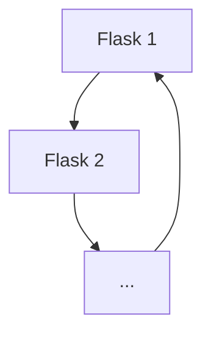

# Combined MinerU Markdown

## PDF Pages 1-17

# RESEARCH

# Open Access

# Metabolic engineering and adaptive laboratory evolution of Kluyveromyces Marxianus for lactic acid production

Jolien Smets $^{1,2}$ , Héctor Escribano Godoy $^{1,2}$ , Johanna Goossenaerts $^{1,2}$ , Eva Van Bun $^{1,2}$ , Quinten Deparis $^{1,2}$ , Jeroen Bauwens $^{1,2}$ , Raúl A. Ortiz-Merino $^{1,2}$ , Eugenio Mancera $^{3,4}$ , Alexander DeLuna $^{5}$ and Kevin J. Verstrepen $^{1,2*}$

# Abstract

Background Poly lactic acid (PLA) is one of the most promising bioplastics due to its interesting mechanical and physical properties, low carbon footprint, and biodegradability. PLA is produced from lactic acid (LA) that is either sourced from petrochemical industries or obtained through microbial fermentation using lactic acid bacteria, with the latter accounting for 90% of total LA production. While the bio-based production is more sustainable, it requires complex and expensive feedstocks and large amounts of neutralization agents for pH control during fermentation.

Results We explored the potential of a non-conventional, acid-tolerant yeast Kluyveromyces marxianus for LA production. First, we analyzed 168 genetically diverse K. marxianus strains to identify the best candidate chassis strains and each of the 10 selected strains was genetically engineered to produce LA. The best candidate strain, Km3, was subjected to adaptive laboratory evolution, yielding a further 18% increase in LA production, reaching titers of 120 g L $^{-1}$ LA and a yield of 0.81 g g $^{-1}$ , while requiring less neutralization agent and showing capacity to efficiently ferment xylose-containing feedstocks. Genome sequencing identified a mutation in the general transcription factor gene SUA7 that proved causal for the increased performance of the evolved clone.

Conclusions Our results highlight the potential of integrating state-of-the-art techniques with the genetic diversity of non-standard microbes to obtain superior microbial cell factories that can ferment xylose-containing media and can be harnessed for sustainable commercial production of fine chemicals through precision fermentation.

Keywords Adaptive laboratory evolution, Non-conventional yeast, Bioeconomy, Bioplastics, Microbial cell factory, Stress tolerance, Lactic acid

\*Correspondence:

Kevin J. Verstrepen

kevin.verstrepen@kuleuven.be

Full list of author information is available at the end of the article

BMC

© The Author(s) 2025. Open Access This article is licensed under a Creative Commons Attribution-NonCommercial-NoDerivatives 4.0 International License, which permits any non-commercial use, sharing, distribution and reproduction in any medium or format, as long as you give appropriate credit to the original author(s) and the source, provide a link to the Creative Commons licence, and indicate if you modified the licensed material. You do not have permission under this licence to share adapted material derived from this article or parts of it. The images or other third party material in this article are included in the article's Creative Commons licence, unless indicated otherwise in a credit line to the material. If material is not included in the article's Creative Commons licence and your intended use is not permitted by statutory regulation or exceeds the permitted use, you will need to obtain permission directly from the copyright holder. To view a copy of this licence, visit http://creativecommons.org/licenses/by-nc-nd/4.0/.

Graphical abstract   

natural_image

Circular arrangement of colorful heart-shaped bubbles on white background (no text or symbols)

high-throughput
phenotypic screen

natural_image

Blue icon of a wrench inside a cloud shape (no text or symbols)

pdc1Δ   
cyb2Δ   
L-LDH

genetic modification of 10 strains for lactic acid production   

flowchart

  
13.5x growth in LA 18% LA production

adaptive laboratory evolution for LA tolerance   

text_image

120 g L⁻¹
0.81 g g⁻¹
1.44 g L⁻¹ h⁻¹

bioreactor-scale lactic acid fermentation

# Background

In 2023, 414 million tons of plastics were produced worldwide $[1]$ . Over 99% of this production is from fossil-based resources while less than 1% is obtained through more sustainable bio-based processes $[1]$ . One of the most promising bio-based plastics is poly lactic acid (PLA) (production of around 500 ktons/year), obtained through polymerizing lactic acid (LA) building blocks $[2, 3]$ . Currently, over 90% of LA is produced using fermentation by lactic acid bacteria (LAB) to obtain optically pure D- or L-LA $[4]$ . However, drawbacks, including the use of large quantities of neutralization agents such as sodium hydroxide or calcium carbonate (lime), and complex nutrient requirements, are limiting the industrial implementation of sustainable (P)LA production and are driving the search for alternative microorganisms with superior industrial performance $[4, 5]$ .

Yeast is used extensively as a microbial cell factory for the production of bio-based compounds. Baker's yeast, Saccharomyces cerevisiae, is often the organism of choice, as it is safe, robust towards environmental challenges encountered during industrial fermentation process (e.g. inhibitors, osmotic stress, hydrostatic pressure) and has an elaborate genetic toolbox available $[6]$ . Together, this makes S. cerevisiae an ideal chassis strain for the commercial production of a large array of compounds such as bioethanol $[6]$ and ascorbic acid $[7]$ . However, several metabolic limitations make S. cerevisiae less suitable for certain industrial applications: (i) as a Crabtree-positive yeast, S. cerevisiae tends to favor ethanol production under high sugar concentrations, which may compete with product formation and requires extensive genetic engineering for the redirection of carbon flux toward the target products $[8]$ and (ii) despite its general robustness,

it is still quite sensitive to extreme conditions encountered in some industrial processes, such as high temperatures $[9–11]$ . While metabolic and evolutionary engineering can help reduce these drawbacks, S. cerevisiae remains a sub-optimal choice for some specific applications where cells are subjected to low pH, as is the case in LA fermentations. This highlights the importance of exploiting other microbial species to develop robust microbial platform strains.

One promising yeast species for industrial applications is Kluyveromyces marxianus. It combines several features that make it an attractive microbial cell factory for various bio-based chemicals, owing to four main advantages.

Table 1 Strains used in this study 

<table><tr><td>Strain</td><td>Genotype</td><td>Source/culture collection</td></tr><tr><td>Strain01-80</td><td>K. marxianus isolates from Mexico</td><td>(33)</td></tr><tr><td>Strain81-168</td><td>Isolates from culture collections</td><td>NBRC, DBVPG, CBS, NCYC, BKM, JCM</td></tr><tr><td>NBRC 1777</td><td>K. marxianus NBRC 1777 dnl4Δ</td><td>This study</td></tr><tr><td>Km1</td><td>YMX001590 dnl4Δ</td><td>This study</td></tr><tr><td>Km2</td><td>YMX000998 dnl4Δ</td><td>This study</td></tr><tr><td>Km3</td><td>YMX001076 dnl4Δ</td><td>This study</td></tr><tr><td>Km4</td><td>YMX001884 dnl4Δ</td><td>This study</td></tr><tr><td>Km5</td><td>YMX001887 dnl4Δ</td><td>This study</td></tr><tr><td>Km6</td><td>YMX003874 dnl4Δ</td><td>This study</td></tr><tr><td>Km7</td><td>YMX004060 dnl4Δ</td><td>This study</td></tr><tr><td>Km8</td><td>CBS 5671 dnl4Δ</td><td>This study</td></tr><tr><td>Km9</td><td>DBVPG 3436 dnl4Δ</td><td>This study</td></tr><tr><td>Km1-9 $^{pdc1,LDH}$ </td><td>Km1-9 pdc1Δ::LpLDH</td><td>This study</td></tr><tr><td>Km1-9 $^{pdc1,LDH, cyb2}$ </td><td>Km1-9 pdc1Δ::LpLDH cyb2Δ</td><td>This study</td></tr><tr><td>Km3 $^{eng}$ </td><td>Km3 pdc1Δ::LpLDH cyb2Δ</td><td>This study</td></tr><tr><td>Km3 $^{eng}$ eA</td><td>Km3 $^{eng}$  evolved for LA tolerance – from population A</td><td>This study</td></tr><tr><td>Km3 $^{eng}$ eA $^{SUA7wt}$ </td><td>Km3 $^{eng}$ eA SUA7 $^{835C}$ ::SUA7 $^{835T}$ </td><td>This study</td></tr><tr><td>Km3 $^{eng}$ eA $^{PMA1wt}$ </td><td>Km3 $^{eng}$ eA PMA1 $^{1515A}$ ::PMA1 $^{1515G}$ </td><td>This study</td></tr><tr><td>Km3 $^{eng}$ eA $^{VTS1wt}$ </td><td>Km3 $^{eng}$ eA VTS1 $^{882T}$ ::VTS1 $^{882C}$ </td><td>This study</td></tr><tr><td>Km3 $^{eng}$ eB</td><td>Km3 $^{eng}$  evolved for LA tolerance – from population B</td><td>This study</td></tr><tr><td>Km3 $^{eng}$ eB $^{BCK1wt}$ </td><td>Km3 $^{eng}$ eB BCK1 $^{2725T}$ ::BCK1 $^{2725G}$ </td><td>This study</td></tr><tr><td>Km3 $^{eng}$ eB $^{PHO81wt}$ </td><td>Km3 $^{eng}$ eB PHO81 $^{160C,162G}$ ::PHO81 $^{160G,162A}$ </td><td>This study</td></tr><tr><td>Km3 $^{eng}$ eB $^{PHO81pam}$ </td><td>Km3 $^{eng}$ eB PHO81 $^{162G}$ ::PHO81 $^{162A}$ </td><td>This study</td></tr><tr><td>Km3 $^{eng}$ eC</td><td>Km3 $^{eng}$  evolved for LA tolerance – from population C</td><td>This study</td></tr><tr><td>Km3 $^{eng}$ eC $^{ERG3wt}$ </td><td>Km3 $^{eng}$ eC ERG3 $^{598G}$ ::ERG3 $^{598A}$ </td><td>This study</td></tr><tr><td>Km3 $^{eng}$ eC $^{NCB2wt}$ </td><td>Km3 $^{eng}$ eC NCB2 $^{80C}$ ::NCB2 $^{80T}$ </td><td>This study</td></tr><tr><td>Km3 $^{eng}$ eC $^{YCF1_2wt}$ </td><td>Km3 $^{eng}$ eC YCF1_2 $^{1481G}$ ::YCF1_2 $^{1481A}$ </td><td>This study</td></tr><tr><td>Km3 $^{eng}$ , SUA7*</td><td>Km3 $^{eng}$ SUA7 $^{G834C, T835C}$ </td><td>This study</td></tr><tr><td>Km3 $^{eng}$ , SUA7pam</td><td>Km3 $^{eng}$ SUA7 $^{G834C}$ </td><td>This study</td></tr><tr><td>Km3 $^{eng}$ ,BCK1*</td><td>Km3 $^{eng}$ BCK1 $^{G2725T}$ </td><td>This study</td></tr><tr><td>Km3 $^{eng}$ , SUA7*,BCK1*</td><td>Km3 $^{eng}$ SUA7 $^{G834C, T835C}$ BCK1 $^{G2725T}$ </td><td>This study</td></tr></table>

Firstly, like S. cerevisiae, K. marxianus received the GRAS (Generally Recognized As Safe) and QPS (Qualified Presumption of Safety) labels, decreasing the administrative hurdle for use in industrial applications $[12, 13]$ . Secondly, K. marxianus can grow very fast, with doubling times up to $0.75 \, h^{-1}$ $[14, 15]$ , and it is acid tolerant with a pH range for growth between 3 and 8 $[16]$ . Thirdly, it can natively metabolize sugars present in lignocellulosic feedstocks, such as hemicellulose-derived xylose and arabinose, making it a suitable candidate for production of bio-based chemicals from cheap second-generation feedstocks $[17]$ . Finally, the molecular toolbox to genetically engineer K. marxianus is growing steadily, not in the least with the implementation of CRISPR/Cas9-based techniques $[18–22]$ . In addition, a set of promoters and terminators suitable for metabolic engineering was identified $[22, 23]$ , and a metabolic model was established $[24–26]$ . Furthermore, a few studies already engineered K. marxianus as a cell factory $[19, 27–30]$ . However, these studies failed to reach economically viable LA titers and yields, required high pitching rates, and used fermentation parameters, such as high aeration, that limit industrial implementation $[28–30]$ .

Despite the increased interest in K. marxianus as a potential industrial chassis, its genetic and phenotypic diversity has only received limited attention $[31]$ , with most research teams using the same type strains. In this study, we combine different state-of-the-art engineering strategies and the underexplored natural K. marxianus biodiversity to obtain superior cell factories that combine higher titers, yields and productivity in industrially relevant conditions. Specifically, we screen 168 different K. marxianus strains to identify 10 genetically distinct strains that show superior industrially-relevant phenotypes. Next, we engineer each of the 10 strains to produce LA and further optimize production in the best candidates by using adaptive laboratory evolution (ALE) and process tuning, ultimately resulting in a process that reaches high titers (up to 120–122 g L $^{-1}$ ) of LA while requiring less pH neutralization compared to the bacterial process (pH 7.0) $[32]$ . Moreover, the ALE resulted in the identification of a novel mutation in transcription factor IIB Sua7 that improves biomass production under LA stress by 13.5-fold and LA production by 18%.

# Materials and methods

# Strains, plasmids and strain construction

# Strains

A detailed overview of the strains used and engineered in this paper is given in Table 1. The wild type K. marxianus strains were either ordered from the NITE Biological Resource Center (NBRC 1777), Industrial Yeast Collection DBVPG, Fungal & yeast collection of Westerdijk Fungal Biodiversity Institute (CBS), Natural Collection

of Yeast Cultures (NCYC), Russian Collection of Microorganisms (BKM), Japan Collection of Microorganisms (JCM), or were natural isolates.

# Plasmid construction

The Lactiplantibacillus plantarum L-lactate dehydrogenase (LpLDH) gene (accession no. WP\_003642078.1) codon-optimized for S. cerevisiae was used. The LpLDH expression cassette was constructed using the NEBuilder HiFi DNA assembly Mix (New England Biolabs) in a 20 $\mu$ L reaction for 60 min at 50 °C. The KmPDC1 promoter and terminator were polymerase chain reaction (PCR)-amplified from the K. marxianus NBRC 1777 genome (primers in Table S1, Supplemental File 1). The PCR products were purified with the QIAGEN PCR purification kit or through ethanol precipitation. The constructed plasmids were transformed to and stored in Escherichia coli DH5 $\alpha$ .

# Strain construction and yeast transformation

For the deletion of PDC1 and CYB2, two 90 bp oligonucleotides were designed to be homologous to the regions flanking the genes (Table S1, Supplemental File 1). The oligos had a 20 bp overlap with each other. Annealing and extension of the repair template was carried out using the Phusion polymerase (EMBL).

Genomic regions were targeted for engineering using a CRISPR/Cas9-gene editing tool for K. marxianus developed by Rajkumar et al. 2019 [22]. The pUCC001 (Addgene #124451) CRISPR-plasmid contained a hygromycin-resistance marker for easy selection after yeast transformation. Table S2, Supplemental File 1 lists the guide DNA sequences used to target the different genetic loci. To revert the identified mutations to their wild type nucleotide, gDNAs were designed to specifically target the mutant nucleotide. If the mutation was heterozygous, no repair template was provided, since the other allele could be used to repair the double strand break correctly. Otherwise, a repair template was designed that contains the wild type nucleotide (Table S1, Supplemental File 1). Reverting the PHO81 mutation in Km3 $^{eng}$ eB and introducing the SUA7 mutation in the non-evolved strain Km3 $^{eng}$ required modification of the protospacer adjacent motif (PAM) site, which was included in the repair template. As control, strains were constructed that only contain the PAM mutation and no other modifications. All genetic modifications were verified by Sanger sequencing (Eurofins Genomics).

Yeast transformations were performed through heat shock $[33]$ or electroporation $[34]$ . For the heat shock, a single colony of yeast was inoculated in 5 mL YPD2% (10 g L $^{-1}$ yeast extract (YE, International Medical Products), 20 g L $^{-1}$ bacteriological peptone (International Medical Products), 20 g L $^{-1}$ D-glucose (Merck)) in a glass tube and grown shaking overnight at 30 °C. After 16 h, 500 μL of culture was inoculated in 50 mL of 2x YPAD4% (2x YPD, 57.8 mg L $^{-1}$ adenine (Sigma-Aldrich)) in a 250 mL flask and grown shaking at 30 °C for 3.5-4 h. The cells were centrifuged for 5 min at 3000 rpm and washed with 25 mL sterile water. The cells were resuspended in 1.0 mL sterile water, transferred to a sterile 1.5 mL Eppendorf tube and centrifuged for 30 s at 3000 rpm. The cells were resuspended in 500 μL sterile water (100 μL per transformation) and 100 μL aliquots were transferred to sterile tubes, which were centrifuged for 30 s and the supernatant was removed. Then, 326 μL of transformation mix (240 μL 50% (w/v%) PEG 3350 (Sigma-Aldrich), 36 μL 1 M lithium acetate (Merck), 50 μL 2 mg mL $^{-1}$ single-stranded carrier DNA (boiled for 10 min at 98 °C, Thermo Fisher Scientific)), 400 ng CRISPR-plasmid, 4–6 μg donor DNA and sterile water to a total volume of 360 μL were added. The mixture was thoroughly vortexed for resuspension of the cells. The cells were heat-shocked for 30 min in a 42 °C water bath, after which they were centrifuged for 1 min at 3000 rpm and the supernatant was carefully removed. For recovery, the cells were resuspended in 1 mL YPD2% and incubated shaking for 3–4 h at 30 °C. Finally, the cells were plated on selective medium (150 μg L $^{-1}$ hygromycin, Life Technology) and incubated at 30 °C.

For yeast electroporation, the inoculum was prepared similar to the heat-shock protocol. The cell pellet was resuspended in 25 mL conditioning buffer (2.5 mL 1 M lithium acetate, 2.5 mL 10x TE buffer pH 8.0, 250 $\mu$ L DL-dithiothreitol (Sigma-Aldrich), 20 mL sterile milliQ water) and incubated for maximally 50 min at room temperature. The cells were centrifuged at 4 °C for 5 min at 3000 rpm and washed with 20 mL ice-cold sterile water. From here on, the cells were kept on ice. The cells were washed with 10 mL ice-cold water and centrifuged, followed by washing with 5 mL ice-cold 1 M sorbitol and centrifugation. The cells were resuspended in 500 $\mu$ L ice-cold 1 M sorbitol and 100 $\mu$ L was aliquoted per electroporation. To each aliquot, 400 ng CRISPR-plasmid and 4–6 $\mu$ g of donor DNA was added, and the mixture was incubated for 5–10 min on ice. The electroporation was done at 2.0 kV. Immediately after electroporation, 1 mL of ice-cold YPD:1 M sorbitol (1:1) was added. The recovery was the same as for the heat-shock protocol described above.

# High throughput screening of K. marxianus collection

To establish a high-throughput screening set-up, the strains were pinned in triplicates on solid medium that consisted of 20 g L $^{-1}$ bacteriological agar (VWR), 10 g L $^{-1}$ YE and 20 g L $^{-1}$ bacteriological peptone. Other components for each selection condition were added according to Table 2 and the strains were grown at 37–42 °C.

Table 2 High-throughput screening conditions 

<table><tr><td>Condition</td><td>Carbohydrate</td><td>Inhibitor</td><td>Final pH</td></tr><tr><td>Glucose pH 6.5</td><td>6% glucose</td><td></td><td>6.5</td></tr><tr><td>Glucose pH 3.5</td><td>6% glucose</td><td></td><td>3.5</td></tr><tr><td>Xylose pH 6.5</td><td>4% xylose</td><td></td><td>6.5</td></tr><tr><td>Xylose pH 3.5</td><td>4% xylose</td><td></td><td>3.5</td></tr><tr><td>Xylitol pH 6.5</td><td>0.5% xylitol</td><td></td><td>6.5</td></tr><tr><td>Xylitol pH 3.5</td><td>0.5% xylitol</td><td></td><td>3.5</td></tr><tr><td>Arabinose pH 6.5</td><td>0.5% arabinose</td><td></td><td>6.5</td></tr><tr><td>Arabinose pH 3.5</td><td>0.5% arabinose</td><td></td><td>3.5</td></tr><tr><td>Cellobiose pH 6.5</td><td>2% cellobiose</td><td></td><td>6.5</td></tr><tr><td>Cellobiose pH 3.5</td><td>2% cellobiose</td><td></td><td>3.5</td></tr><tr><td>25 g  $L^{-1}$  LA</td><td>6% glucose</td><td>25 g  $L^{-1}$  lactic acid</td><td></td></tr><tr><td>50 g  $L^{-1}$  LA</td><td>6% glucose</td><td>50 g  $L^{-1}$  lactic acid</td><td></td></tr><tr><td rowspan="2">pH 3.5</td><td>6% glucose</td><td></td><td>3.5</td></tr><tr><td>4% xylose</td><td></td><td></td></tr><tr><td rowspan="2">pH 3.0</td><td>6% glucose</td><td></td><td>3.0</td></tr><tr><td>4% xylose</td><td></td><td></td></tr><tr><td rowspan="2">pH 2.5</td><td>6% glucose</td><td></td><td>2.5</td></tr><tr><td>4% xylose</td><td></td><td></td></tr><tr><td rowspan="2">Furfural pH 6.5</td><td>6% glucose</td><td>0.6% furfural</td><td>6.5</td></tr><tr><td>4% xylose</td><td></td><td></td></tr><tr><td rowspan="2">Furfural pH 3.5</td><td>6% glucose</td><td>0.6% furfural</td><td>3.5</td></tr><tr><td>4% xylose</td><td></td><td></td></tr><tr><td rowspan="2">HMF pH 6.5</td><td>6% glucose</td><td>0.1% HMF</td><td>6.5</td></tr><tr><td>4% xylose</td><td></td><td></td></tr><tr><td rowspan="2">HMF pH 3.5</td><td>6% glucose</td><td>0.1% HMF</td><td>3.5</td></tr><tr><td>4% xylose</td><td></td><td></td></tr></table>

Each of the listed conditions was tested at 37 and 42 °C. Abbreviations: HMF, 5-hydroxymethylfurfural

Table 3 Criteria for strain selection 

<table><tr><td>Strain</td><td>Main selection criteria</td></tr><tr><td>NBRC 1777</td><td>Benchmark strain</td></tr><tr><td>Km1</td><td>LA tolerance (50 g L-1LA)</td></tr><tr><td>Km2</td><td>Glucose, Xylose, Xylitol, Arabinose pH 3.5, Cellobiose, Low pH, LA tolerance, Furfural pH 6.5, HMF</td></tr><tr><td>Km3</td><td>Low pH, LA tolerance (50 g L-1LA), Furfural pH 3.5, HMF pH 3.5</td></tr><tr><td>Km4</td><td>Glucose, Xylose, Xylitol pH 3.5, Arabinose, Cellobiose pH 3.5, LA tolerance, Low pH, HMF</td></tr><tr><td>Km5</td><td>Glucose pH 6.5, Xylose pH 3.5, Arabinose pH 3.5, Cellobiose, Low pH, LA tolerance, Furfural pH 3.5, HMF pH 6.5</td></tr><tr><td>Km6</td><td>Overall average growth</td></tr><tr><td>Km7</td><td>Cellobiose pH 3.5, LA tolerance, Furfural</td></tr><tr><td>Km8</td><td>Glucose, Xylose pH 3.5, Xylitol, Arabinose, Cellobiose, LA tolerance, Low pH, Furfural pH 6.5, HMF</td></tr><tr><td>Km9</td><td>Glucose pH 3.5, Arabinose pH 3.5, Furfural pH 6.5, HMF pH 3.5, LA tolerance, Low pH</td></tr></table>

Selection of a phenotypically diverse set of strains for further genetic engineering. The colony sizes for the strains in each condition were listed and the top 60 strains were taken into account. Each selected strain was in the top 60 for at least one condition

Different carbon sources present in lignocellulosic waste streams, such as glucose, xylose (Sigma-Aldrich), xylitol (Sigma-Aldrich), arabinose (Sigma-Aldrich) and cellobiose (Sigma-Aldrich), were screened. To screen for lignocellulosic inhibitor tolerance (furfural (Sigma-Aldrich) and 5-hydroxymethylfurfural (HMF, Sigma-Aldrich)), a mixture of glucose and xylose was provided together with the inhibitor. Pictures were taken by the robotic handling system HiTMan (https://www.biw.kuleuven.be/m2s/cmpg/hitman). The colony area (pixels) was determined using an in-house developed image analysis pipeline in MATLAB [35]. The Z-score was calculated per condition and the strains and conditions were clustered by similarity using the heatmap.2 function in R studio (version 2023.03.1).

To select the optimal candidate strains, the strains in the top 60 largest colony size for each of the tested conditions were listed. The selected strains were at least for one condition in the top 60, ensuring a large phenotypic diversity in the strain selection. The selection criteria for each strain are listed in Table 3.

# Fermentation

# Small-scale fermentation

The small-scale batch fermentations were performed in a 250 mL Erlenmeyer flask with 50 mL rich or complex fermentation medium (see below). The inoculum was obtained by growing the strains in 20 mL fermentation medium for 24 h. Then, absorbance was measured to determine the inoculum volume to transfer to start the fermentation at an absorbance of 0.2 in 50 mL of fermentation medium. 1.2 mL samples were taken for analytical measurements (HPLC) and to measure absorbance.

The rich fermentation medium is YPD (10 g L $^{-1}$ YE, 20 g L $^{-1}$ bacteriological peptone, glucose). The complex fermentation medium consists of 3.8 g L $^{-1}$ yeast nitrogen base without amino acids without ammonium sulphate (Formedium), 0.79 g L $^{-1}$ complete supplement mixture (Formedium), 5 g L $^{-1}$ YE and 2.3 g L $^{-1}$ urea (Sigma-Aldrich).

# 0.5 L bioreactor fermentation

The Infors HT Multifors 6×0.5 L system was used to evaluate the constructed strains further. An initial volume of 250 mL complex fermentation medium with 10% (w/v%) glucose was added to the reactors. A stock solution of 60% (w/v%) glucose was used for constant feeding (1.0 g $_{glucose}$ h $^{-1}$ ) during the experiment. The inoculum was a loop full of a single colony transferred to 50 mL complex fermentation medium with 10% (w/v%) glucose in a 250 mL flask and grown at 30 °C in a shaking incubator (200 rpm) for 20 h. The medium was refreshed 4 h prior to inoculation. The cells were pelleted (3000 rpm, 5 min), resuspended in 2 mL sterile water and transferred to the bioreactors. The pH was controlled at 6.0 (or 4.5 or 3.5) using 6 M NaOH (VWR), and temperature was maintained at 30 °C throughout the fermentation. The dissolved oxygen (DO) was kept at >20% during the

growth phase (0–8 h) by varying stirring rate (between 300 and 1000 rpm), while aeration was kept constant at 0.1 L min $^{-1}$ . During the production phase (8–94.5 h), fixed stirring (300 rpm) and aeration (0.1 L min $^{-1}$ ) were maintained, thereby no longer controlling the DO. The residual glucose concentration, LA production, byproduct formation and dry cell weight were followed up during the run by regular sampling (5 mL sample). The parameters pH, DO, temperature, stirring, aeration, and base, feed and antifoam (Struktol J633A) addition were logged and followed up online. An overview of the stirring, aeration, DO, and feeding in each reactor can be found in Figure S1, Supplemental File 2.

The mass balance was constructed according to the formulas in Figure S2, Supplemental File 2. Any volume changes due to addition of base and feedstock, and removal of glucose and LA through sampling were considered to calculate the final LA yield and productivity. Theoretical maximal yields for the different compounds were taken from Pentjuss et al. 2017 [26].

# Adaptive laboratory evolution

Cell cultures were grown in evolution medium (1.9 g L $^{-1}$ yeast nitrogen base without amino acids without ammonium sulphate, 0.79 g L $^{-1}$ complete supplement mixture, 5 g L $^{-1}$ ammonium sulphate (Thermo Fischer Scientific)) with 5% (w/v%) glucose containing varying concentrations of L-LA (Sigma-Aldrich) with an initial optical density (OD) of 0.1. Three parallel cultures (A, B, C) were maintained with and one culture without L-LA addition (Control), although the strain itself produced LA as well. The initial concentration of L-LA was 15 g L $^{-1}$ L-LA. During the evolution experiment, the L-LA concentration was increased to 30 g L $^{-1}$ L-LA with 5 g L $^{-1}$ steps. Similar to other studies [36, 37], no pH control was applied. This resulted in an initial pH of 4.73, 2.51, 2.35, 2.31 and 2.21 for 0, 15, 20, 25 and 30 g L $^{-1}$ L-LA, respectively. The number of generations was calculated according to Eq. 1. When a culture reached at least 3 generations, a volume was transferred to 50 mL of fresh L-LA medium to an OD of 0.1 (14–17 transfers for each population). The ALE process was concluded once the population showed a sustained increase in growth rate compared to the starting population and individual strains with enhanced tolerance could be isolated. Then the best-performing populations were plated on evolution medium and 30 random colonies per population were picked to assess LA tolerance (0, 10, 20, 30 g L $^{-1}$ LA) in complex medium without YE (96-well format). Per population, 8 single colonies with the highest final cell density were picked for small-scale fermentations. The best LA-producing isolate for each population was sent for whole genome sequencing. The strains with or without mutations introduced were tested in 10 g L $^{-1}$ L-LA or 3 g L $^{-1}$ acetic acid in a similar way as the single colonies after ALE.

Eq. 1: Calculation of the number of generations grown during the ALE experiment. $Abs_{initial}$ , absorbance at inoculation; $Abs_{final}$ , absorbance before transfer.

$$
g e n e r a t i o n s = \frac {\log \left(\frac {A b s _ {f i n a l}}{A b s _ {i n i t i a l}}\right)}{0 . 3}
$$

# Cell viability assay

The cell viability was assessed through methylene blue staining (stains dead cells) and cell counting using TC20 Automated Cell Counter (BioRad). 100 $\mu$ L of 0.1% (w/v%) methylene blue (Sigma-Aldrich) was added to 100 $\mu$ L of appropriately diluted cell culture and incubated for 1 min. Then, the cell count was measured. The Cell Counter automatically determines the total cell count and the stained (=dead) cell count. The cell viability was calculated according to Eq. 2.

Eq. 2: Cell viability. The total cell count (cells $mL^{-1}$ ) is the result of counting all cells, while dead cell count (cells $mL^{-1}$ ) is the result of counting only the methylene blue stained cells.

$$
Cell\ viability (\%) = \frac{total\ cell\ count\ \left(\frac{cells}{mL}\right) - dead\ cell\ count\ \left(\frac{cells}{mL}\right)}{total\ cell\ count\ \left(\frac{cells}{mL}\right)} *100
$$

# Whole genome sequencing and analysis

The genomic DNA was isolated using the Genomic tip-20G kit from QIAGEN. Whole genome Illumina sequencing was performed at BGI Hongkong. The raw sequencing reads were first trimmed using Trimmomatic (version 0.39) to remove low-quality bases and adapter sequences [38]. NBRC 1777 was used as a reference (GCA\_016626105.1) using BWA MEM (version 0.7.12-r1039) [39]. After mapping, Picard (version 2.18.12) was used to mark duplicate reads and add read group information [40]. Variant calling was performed using the Genome Analysis Tool Kit (GATK; version 4.2.4.1) [41]. Variants were filtered using DP>40 (depth of coverage greater than 40), FS<40 (Fisher Strand Bias), MQ>40 (mapping quality), MQRankSum >-10, ReadPosRankSum >-8, QUAL>50 (variant quality score), and a variant frequency threshold>12.5% of the total reads at a position. The combined Variant Call Format (VCF) file was annotated using NGSEP (version 4.0.3) [42]. Bcftools (version 1.9.0) was used to collect unique variants per sample using the non-evolved strain for comparison [43]. The phenotypic effect of an amino acid substitutions was estimated using the online tool SIFT (Sorting Intolerant From Tolerant, https://sift.bii.a-star.edu.sg/www/SIFT\_seq\_submit2.html) [44].

# Analytical methods

An Acquity HPLC (Waters) with an Aminex HPX-87 H column (Biorad) equipped with 2998 PDA (wavelength: 215 nm, bandwidth 4.8 nm) and 2414 RI detectors was used to determine acid and sugar concentrations. The mobile phase was 5 mM sulphuric acid (VWR), the column temperature 50 °C and the flow rate 0.6 mL min $^{-1}$ . 1.5 mL samples were prepared in 2 mL clear vials (LCGC clr 12×32 scw slt-PTFE/Sil, Waters). 20 μL of sample was injected for a run time of 30 min per sample. Urea concentration was measured using the Urea test kit for the Gallery Plus Beer Master (Thermo Fischer Scientific). The dry cell weight was determined by centrifuging (13,000 rpm, 10 min) 1 mL of cell culture in tarred 1.5 mL Eppendorf tubes and washing the cell pellet with 0.5 mL milliQ water. The cell pellet was then dried overnight and the difference in weight was measured to estimate the cell density in grams per liter.

# Statistical analyses

All statistical analysis was performed in R studio (version 2023.03.1). The statistical tests used for each experiment are indicated in the Figure legends.

# Results

# High-throughput screening of 168 K. marxianus strains reveals large phenotypic diversity

An initial high-throughput screening was performed on 168 K. marxianus strains isolated from diverse environments, such as agave fermentations $[45]$ , soil and dairy, on agar-based media under 19 conditions targeting various yeast characteristics relevant for industrial fermentation processes (see Table 2 for a comprehensive overview of the conditions tested). Specifically, we assessed growth in a range of stress conditions (high acid concentrations, low pH, high temperature), and the consumption of and tolerance to lignocellulose-derived carbon sources (glucose, xylose, xylitol, arabinose, cellobiose) and inhibitors (furfural, 5-hydroxymethylfurfural (HMF)), to ultimately identify the most suitable chassis strains to subject to genetic engineering for LA production. In several conditions, glucose and xylose were provided as mixed carbon sources to mimic sugar profiles typical of lignocellulosic hydrolysates. The highest total sugar concentration used during the screening was 10% (w/v%). The concentrations of the carbon sources and inhibitors were chosen to mimic industrially-relevant conditions and lignocellulosic hydrolysates.

The 168 strains showed large phenotypic differences across the test conditions (Figure S3, Supplemental File 2). Figure S4, Supplemental File 2 shows the correlation coefficients $p<0.05$ between all tested conditions. A strong correlation was observed between growth on different carbon sources, at pH 3.5 (R 0.42–0.79) and 6.5 (R 0.67–0.88). The condition with 50 g L $^{-1}$ LA was clearly separated from all other conditions, likely because only a few strains were able to grow in this extreme condition. Generally, K. marxianus strains grew significantly better at pH 6.5 than at pH 3.5, for any carbon source other than xylose (Fig. 1; Figure S5, Supplemental File 2). Remarkably, even at pH 2.5, all strains managed to grow when glucose and xylose were used as carbon source, although colony size was on average 18% smaller compared to pH 3.5. By contrast, all but two strains (Km3 and Km4) failed to grow completely in medium supplemented with 50 g L $^{-1}$ LA. Additionally, the strains grew well in the same conditions at higher temperature (42 °C; Figure S6, Supplemental File 2), allowing for processes to occur at higher temperature, with lower cooling costs.

Based on this phenotypic screen, in total 10 strains were selected for further engineering (Table 3), including 9 overall robust, diverse strains, and NBRC 1777, a commonly used K. marxianus chassis strain, as a benchmark.

# Genetic engineering enables LA production

LA production was enabled in the 10 selected strains by three genetic modifications introduced by CRISPR/Cas9-based genetic engineering (Fig. 2A) and the resulting LA production was evaluated in shake flask assays in rich medium (Fig. 2B and C; Figure S7, Supplemental File 2). Firstly, we deleted the pyruvate decarboxylase 1 (PDC1) gene to increase levels of the LA precursor pyruvate. Simultaneously, the Lactiplantibacillus plantarum L-lactate dehydrogenase (LpLDH) gene was introduced at the PDC1 locus. The wild type K. marxianus strains do not produce detectable amounts of LA and this modification was sufficient to introduce LA production in all strains, with $Km3^{pdc1,LDH}$ , $Km4^{pdc1,LDH}$ , $Km5^{pdc1,LDH}$ producing significantly more LA than NBRC $1777^{pdc1,LDH}$ , and $Km8^{pdc1,LDH}$ significantly less. Thirdly, we deleted CYB2, which encodes the enzyme cytochrome b2, located in the intermembrane space of the mitochondria [46]. The enzyme can perform the bidirectional conversion between pyruvate and LA and can therefore consume previously produced LA. Deleting CYB2 increased LA titers up to twofold. Fig. 2A and C show the LA production and yield for all engineered strains after 16 h of fermentation, which was sufficient for most strains to reach the maximal LA titer. The different engineered strains showed LA production between 1.7 and 14.8 g L $^{-1}$ , highlighting the drastic effect of genetic background on engineering. The best LA-producing strain, $Km3^{pdc1,LDH}$ , $cyb2$ , produced 14.8 g L $^{-1}$ LA with a yield of 0.68 g $_{LA}$ g $_{glucose}$ $^{-1}$ in a 16 h flask (batch) fermentation with 2% (w/v%) glucose. The effect of the introduced genetic modifications on byproduct formation proved to be strain-dependent. For example, acetic acid production (Figure S8, Supplemental File 2) decreased with deletion of CYB2 for NBRC

  
Fig. 1 High-throughput screening reveals large phenotypic diversity between selected K. marxianus strains. Absolute growth (colony size in pixels) on different carbon sources, LA, low pH and inhibitors (furfural, HMF) on 2% agar plates. Each box represents the growth of 168 isolates (average of 3 replicates each). The strains selected for further genetic engineering are indicated with colored dots. A depiction of all data points can be found in Figure S5, Supplemental File 2. Statistics are pairwise Wilcox-tests. Significance code: $^{***}$ p-value < 0.001; 'n' p-value > 0.05. Abbreviations: HMF, 5-hydroxymethylfurfural

1777 pdc1,LDH, Km4pdc1,LDH, Km5pdc1,LDH, and increased for Km7pdc1,LDH. The strains did not produce glycerol in these conditions.

# Adaptive laboratory evolution improved LA tolerance and production

We hypothesized that LA tolerance was a limiting factor for LA production. The most promising strain (Km3 $^{pdc1,LDH,cyb2}$ , from here on referred to as Km3 $^{eng}$ ) was therefore subjected to ALE under LA stress (Fig. 3A). Three populations were evolved in medium supplemented with L-LA and without pH control (A, B, C), while one control population was evolved without LA addition (Control). It is important to note that during the experiment, Km3 $^{eng}$ also produced LA, thus further increasing the LA stress. Figure 3B depicts the growth rate (generations per hour) throughout the evolution experiment, which is expected to increase when more LA tolerant mutants arise during ALE in LA-containing medium.

After 64, 81, 52 and 104 generations of evolution of populations A, B, C and Control, respectively, we picked 30 single colonies per evolved population and assessed fitness in different concentrations of L-LA (0, 10, 20, 30 g L $^{-1}$ ) (480 cultures in total) (Figure S9A, Supplemental File 2). The non-evolved $Km3^{eng}$ showed growth up to 10 g $L^{-1}$ L-LA, while all evolved strains were able to grow at the highest concentration of 30 g $L^{-1}$ . For each population, except the Control, 8 strains with the highest final cell density at 30 g $L^{-1}$ L-LA were selected for further phenotyping using flask fermentations (24 strains in total) (Figure S9B, Supplemental File 2). Here, 13 of the 24 strains produced more LA than the non-evolved strain.

For the best LA-producing evolved strain of each population (Km3 $^{eng}$ eA, Km3 $^{eng}$ eB and Km3 $^{eng}$ eC), whole genome sequencing was performed and de novo single nucleotide polymorphisms (SNPs) compared to the LA-producing reference parental strain Km3 $^{eng}$ were identified. Km3 $^{eng}$ eA, Km3 $^{eng}$ eB and Km3 $^{eng}$ eC acquired 19, 45 and 24 novel SNPs, respectively (Table S3, Supplemental File 1). To identify mutations that influence LA tolerance, we focused on non-synonymous SNPs in protein-coding regions (Table 4) and reverted these SNPs to their wild type nucleotide in the evolved strains. The reason to use the evolved background for reverse engineering is two-fold. First, to investigate the effect of the mutation on LA tolerance of the evolved background strain, the mutations of interest were removed from the LA tolerant background, which had more potential

```mermaid
graph TD
    A["Glucose"] -->|Glycerol| B["Glycerol"]
    A --> C["PEP"]
    C --> D["Pyruvate"]
    D -->|LpLDH, cyb2| E["L-Lactic acid"]
    D -->|pdc1| F["Ethanol"]
    F --> G["Acetic acid"]
    G --> H["Acetyl-CoA"]
    H --> I["Mitochondria"]
    I --> J["Acetyl-CoA"]
    J --> K["Succinic acid"]
    K --> L["L-Lactic acid"]
    D --> M["Acetic acid"]
    M --> N["CoA"]
    N --> O["Acetyl-CoA"]
    O --> P["Pyruvate"]
    P -->|LpLDH, cyb2| D
    style A fill:#f9f,stroke:#333
    style B fill:#ccf,stroke:#333
    style C fill:#cfc,stroke:#333
    style D fill:#fcc,stroke:#333
    style E fill:#fcf,stroke:#333
    style F fill:#cff,stroke:#333
    style G fill:#ffc,stroke:#333
    style H fill:#cfc,stroke:#333
    style I fill:#fcf,stroke:#333
    style J fill:#cff,stroke:#333
    style K fill:#ffc,stroke:#333
    style L fill:#cfc,stroke:#333
    style M fill:#fcc,stroke:#333
    style N fill:#ffc,stroke:#333
    style O fill:#cfc,stroke:#333
    style P fill:#fcc,stroke:#333
    style Q fill:#cfc,stroke:#333
    style R fill:#fcc,stroke:#333
    style S fill:#cfc,stroke:#333
    style T fill:#fcc,stroke:#333
    style U fill:#cfc,stroke:#333
    style V fill:#fcc,stroke:#333
    style W fill:#cfc,stroke:#333
    style X fill:#fcc,stroke:#333
    style Y fill:#cfc,stroke:#333
    style Z fill:#fcc,stroke:#333
    style AA fill:#cfc,stroke:#333
    style AB fill:#fcc,stroke:#333
    style AC fill:#cfc,stroke:#333
    style AD fill:#fcc,stroke:#333
    style AE fill:#cfc,stroke:#333
    style AF fill:#fcc,stroke:#333
    style AG fill:#cfc,stroke:#333
    style AH fill:#fcc,stroke:#333
    style AI fill:#cfc,stroke:#333
    style AJ fill:#fcc,stroke:#333
    style AK fill:#cfc,stroke:#333
    style AL fill:#fcc,stroke:#333
    style AM fill:#cfc,stroke:#333
    style AN fill:#fcc,stroke:#333
    style AO fill:#cfc,stroke:#333
    style AP fill:#fcc,stroke:#333
    style AQ fill:#cfc,stroke:#333
    style AR fill:#fcc,stroke:#333
    style AS fill:#cfc,stroke:#333
    style AT fill:#fcc,stroke:#333
    style AU fill:#fcc,stroke:#333
    style AV fill:#fcc,stroke:#333
    style AW fill:#fcc,stroke:#333
    style AX fill:#fcc,stroke:#333
    style AY fill:#fcc,stroke:#333
    style AZ fill:#fcc,stroke:#333
    style BA fill:#fcc,stroke:#333
    style BB fill:#fcc,stroke:#333
    style BC fill:#fcc,stroke:#333
    style BD fill:#fcc,stroke:#333
    style BE fill:#fcc,stroke:#333
    style BF fill:#fcc,stroke:#333
    style BG fill:#fcc,stroke:#333
    style BH fill:#fcc,stroke:#333
    style BI fill:#fcc,stroke:#333
    style BJ fill:#fcc,stroke:#333
    style BK fill:#fcc,stroke:#333
    style BL fill:#fcc,stroke:#333
    style BM fill:#fcc,stroke:#333
    style BN fill:#fcc,stroke:#333
    style BO fill:#fcc,stroke:#333
    style BP fill:#fcc,stroke:#333
    style BQ fill:#fcc,stroke:#333
    style BR fill:#fcc,stroke:#333
    style BS fill:#fcc,stroke:#333
    style BT fill:#fcc,stroke:#333
    style BU fill:#fcc,stroke:#333
    style BV fill:#fcc,stroke:#333
    style BW fill:#fcc,stroke:#333
    style BX fill:#fcc,stroke:#333
    style BY fill:#fcc,stroke:#333
    style CA fill:#fcc,stroke:#333
    style CB fill:#fcc,stroke:#333
    style CC fill:#fcc,stroke:#333
    style CD fill:#fcc,stroke:#333
    style DE fill:#fcc,stroke:#333
    style DF fill:#fcc,stroke:#333
    style DG fill:#fcc,stroke:#333
    style BEY fill:#fcc,stroke:#333
    style BFY fill:#fcc,stroke:#333
    style BGY fill:#fcc,stroke:#333
    style BHY fill:#fcc,stroke:#333
    style BIY fill:#fcc,stroke:#333
    style BJY fill:#fcc,stroke:#333
    style BKY fill:#fcc,stroke:#333
    style BLY fill:#fcc,stroke:#333
    style BNY fill:#fcc,stroke:#333
    style BOY fill:#fcc,stroke:#333
    style BPY fill:#fcc,stroke:#333
    style PYY fill:#fcc,stroke:#333
    style QYY fill:#fcc,stroke:#333
    style RYY fill:#fcc,stroke:#333
    style SYY fill:#fcc,stroke:#333
    style TYY fill:#fcc,stroke:#333
    style UYY fill:#fcc,stroke:#333
    style VYY fill:#fcc,stroke:#333
    style WYY fill:#fcc,stroke:#333
    style XYY fill:#fcc,stroke:#333
    style YYY fill:#fcc,stroke:#333
    style ZYY fill:#fcc,stroke:#333
    style ABY fill:#fcc,stroke:#333
    style ACY fill:#fcc,stroke:#333
    style ADY fill:#fcc,stroke:#333
    style AEY fill:#fcc,stroke:#333
    style BFY fill:#fcc,stroke:#333
    style BGY fill:#fcc,stroke:#333
    style BHY fill:#fcc,stroke:#333
    style BIY fill:#fcc,stroke:#333
    style BJY fill:#fcc,stroke:#333
    style KYY fill:#fcc,stroke:#333
    style LYY fill:#fcc,stroke:#333
    style MYY fill:#fcc,stroke:#333
    style NYY fill:#fcc,stroke:#333
    style OYY fill:#fcc,stroke:#333
    style PYY fill:#fcc,stroke:#333
    style QYY fill:#fcc,stroke:#333
    style RYY fill:#fcc,stroke:#333
    style SYY fill:#fcc,stroke:#333
    style BTY fill:#fcc,stroke:#333
    style UYY fill:#fcc,stroke:#333
    style VYY fill:#fcc,stroke:#333
    style WYY fill:#fcc,stroke:#333
    style XYY fill:#fcc,stroke:#333
    style YYY fill:#fcc,stroke:#333
    style ZYY fill:#fcc,stroke:#333
    style ABY fill#000,stroke:#000
    style ACY fill:#000,stroke:#000
    style ADY fill:#000,stroke:#000
    style BEY fill:#000,stroke:#000
    style BFY fill:#000,stroke:#000
    style BGY fill:#000,stroke:#000
    style BHY fill:#000,stroke:#000
    style BIY fill:#000,stroke:#000
    style ADY fill:#000,stroke:#000
    style RYY fill:#000,stroke:#000
    style SYY fill:#000,stroke:#000
    style YYY fill:#000,stroke:#000
    style ZYY fill:#000,stroke:#000
    style ABY fill:#000,stroke:#000
    style ACY fill:#000,stroke:#000
    style ADY fill:#000,stroke:#000
    style BEY fill:#000,stroke:#000
    style BFY fill:#000,stroke:#000
    style BGY fill:#000,stroke:#000
    style BHY fill:#000.000,stroke:#000
    style BIY fill:#000,stroke:#000
    style RYY fill:#000,stroke:#000
    style SYY fill:#000,stroke:#000
    style YYY fill:#000,stroke:#000
    style ZYY fill:#000,stroke:#000
    style ABY fill:#000,stroke:#000
    style ACY fill:#fff,stroke:#000
    style ADY fill:#fff,stroke:#000
    style BEY fill:#fff,stroke:#000
    style BFY fill:#fff,stroke:#000
    style BGY fill:#fff,stroke:#000
    style BHY fill:#fff,stroke:#000
    style BIY fill:#fff,stroke:#000
    style RYY fill:#fff,stroke:#000
    style SYY fill:#fff,stroke:#000
    style YYY fill:#fff,stroke:#000
    style ZYY fill:#fff,stroke:#000
```

flowchart

bar

pdc1Δ::LpLDH
| Sample | L-Lactic acid (g L⁻¹) | LpLDH (g L⁻¹) | LpLDH (cyb2Δ) (g L⁻¹) |
| :--- | :--- | :--- | :--- |
| NBRC 1777 | 5.5 | | 11.5 |
| Km1 | 7.5 | abc | 12.5 |
| Km2 | 7.3 | abc | 11.8 |
| Km3 | 8.2 | a | 12.2 |
| Km4 | 8.7 | a | 14.8 |
| Km5 | 8.9 | a | 12.5 |
| Km6 | 3.5 | d | 11.5 |
| Km7 | 7.8 | ab | 4.8 |
| Km8 | 0.8 | e | 1.5 |
| Km9 | 5.2 | cd | 3.8 |

bar

| Strain | pdc1Δ::LpLDH L-LA yield (g g⁻¹) | pdc1Δ::LpLDH cyb2Δ L-LA yield (g g⁻¹) |
|--------|----------------------------------|----------------------------------------|
| NBRC 1777 | 0.45 | 0.65 |
| Km1 | 0.50 | 0.65 |
| Km2 | 0.55 | 0.68 |
| Km3 | 0.52 | 0.68 |
| Km4 | 0.55 | 0.68 |
| Km5 | 0.53 | 0.68 |
| Km6 | 0.33 | 0.55 |
| Km7 | 0.51 | 0.65 |
| Km8 | 0.25 | 0.62 |
| Km9 | 0.43 | 0.33 |

Fig. 2 (See legend on next page.)

(See figure on previous page.)

Fig. 2 Genetic engineering allows LA production in K. marxianus. A Metabolic pathway (simplified version) to produce LA from central carbon metabolism. Since wild type K. marxianus strains do not produce LA, the genetic modifications included deletion of the pyruvate carboxylase 1 (PDC1) gene, the cytochrome b2 (CYB2) gene and introduction of the L. plantarum L-lactate dehydrogenase (LpLDH) gene. (B) LA production by 10 genetically engineered strains with 2 steps of genetic modifications in rich YPD medium with 2% (w/v%) glucose after 16 h. (C) LA yield in g LA per g consumed glucose after 16 h of fermentation. Measurements are the average of 3 biological replicates and error bars depict standard deviation. Statistics are multiple pairwise-comparisons by Tukey honest significant differences and values that are not significantly different are indicated with the same letter. Abbreviation: PEP, phosphoenolpyruvate.

mutations that could affect LA tolerance. This way we could figure out the effect of the SNP in the context of all the other SNPs. Second, some of the mutations, such as in the essential gene PMA1, need to be heterozygous, as introducing them homozygously would be lethal [47]. When using CRISPR, mutations are almost exclusively introduced homozygously, which makes introducing the (heterozygous) mutations in the wild type very difficult. This approach resulted in Km3 $^{eng}$ eA $^{SUA7wt}$ , Km3 $^{eng}$ eA $^{PMA1wt}$ and Km3 $^{eng}$ eA $^{VTS1wt}$ from Km3 $^{eng}$ eA, Km3 $^{eng}$ eB $^{BCK1wt}$ , Km3 $^{eng}$ eB $^{PHO81wt}$ and Km3 $^{eng}$ eB $^{PHO81pam}$ from Km3 $^{eng}$ eB, and Km3 $^{eng}$ eC $^{ERG3wt}$ , Km3 $^{eng}$ eC $^{NCB2wt}$ and Km3 $^{eng}$ eC $^{YCF1_2wt}$ from Km3 $^{eng}$ eC. These strains were subsequently grown in medium with 10 g L $^{-1}$ L-LA to determine their LA tolerance (Fig. 3C).

LA tolerance decreased for $\mathrm{Km3}^{\mathrm{eng}}\mathrm{eA}^{\mathrm{SUA7wt}}$ compared to $\mathrm{Km3}^{\mathrm{eng}}\mathrm{eA}$ , suggesting that this mutation in the transcription factor Sua7 contributed to the LA tolerance of strain $\mathrm{Km3}^{\mathrm{eng}}\mathrm{eA}$ . A mutation in S. cerevisiae Sua7 $^{\mathrm{S273}}$ , which corresponds to Sua7 $^{\mathrm{S279}}$ in K. marxianus (alignment in Figure S10, Supplemental File 2), was involved in stress tolerance [48]. On the other hand, $\mathrm{Km3}^{\mathrm{eng}}\mathrm{eA}^{\mathrm{PMA1wt}}$ was more LA tolerant than $\mathrm{Km3}^{\mathrm{eng}}\mathrm{eA}$ , indicating that the identified mutation in PMA1 negatively impacts LA tolerance. The VTS1 mutation did not affect LA tolerance when reverted to the wild type nucleotide. In $\mathrm{Km3}^{\mathrm{eng}}\mathrm{eB}$ , reverting the BCK1 mutation to its wild type counterpart (strain $\mathrm{Km3}^{\mathrm{eng}}\mathrm{eB}^{\mathrm{BCK1wt}}$ ) decreased LA tolerance. For PHO81, however, we could not exclude the effect of a synonymous mutation at the PAM site, since it decreased LA tolerance to the same extent as only reverting the identified mutation. Thus, the PHO81 mutation did not improve LA tolerance in the evolved strain. In $\mathrm{Km3}^{\mathrm{eng}}\mathrm{eC}$ , reverting the SNPs in ERG3, NCB2 or YCF1\_2 did not cause significant differences in LA tolerance and therefore these strains were not taken along for further analysis.

The strains with mutations that impacted LA tolerance the most (PMA1, SUA7, BCK1) were evaluated in flask-scale fermentations to determine the effect on LA production, yield, productivity (Fig. 3E-G) and byproduct formation (acetic acid, glycerol and succinic acid; Figure S11, Supplemental File 2). For these investigated strains, LA tolerance correlated strongly with LA production ( $R^{2}$ 0.75) (Fig. 3D), underscoring the validity of our approach to use laboratory evolution for increased LA tolerance to obtain increased LA production. Reverting the SUA7 mutation to the wild type allele decreased the LA level of $Km3^{eng}eA^{SUA7wt}$ to the level of the parental, non-evolved $Km3^{eng}$ , indicating that the mutation had a positive effect on LA production. When the SUA7 mutation was introduced in $Km3^{eng}$ ( $Km3^{eng, SUA7*}$ ), the LA titer increased by 18% (Fig. 3H) compared to $Km3^{eng}$ without the mutation, without affecting LA yield, since more glucose was consumed (Figure S12A, Supplemental File 2), maximal productivity (Figure S13, Supplemental File 2) or growth (Figure S12B, Supplemental File 2). Acetic acid and glycerol increased to the level of the evolved strain. Note that to introduce the SUA7 mutation in $Km3^{eng}$ , an additional mutation of the PAM site for CRISPR/Cas9 targeting was required, but this mutation did not affect LA production (Figure S13, Supplemental File 2). To determine whether the enhanced LA production associated with the SUA7 mutation was due to changes in cell viability, a viability assay was performed (Figure S14, Supplemental File 2). After of 72 h of fermentation, no significant difference in cell viability was observed between strains $Km3^{eng}$ and $Km3^{eng, SUA7*}$ . Interestingly, the SUA7 mutation also improved tolerance against other organic acids, such as acetic acid (Fig. 3I), suggesting that this mutation may be a possible way to engineer K. marxianus' tolerance towards multiple organic acids. Furthermore, the $Km3^{eng, SUA7*}$ was able to ferment xylose-containing medium, showing 23% higher LA production and 34% higher LA yield from xylose compared to $Km3^{eng}$ , opening the door for LA production from lignocellulosic feedstocks (Figure S15, Supplemental File 2).

In $\mathrm{Km3^{eng}eB}$ , a similar effect on LA production was found for BCK1 as for SUA7, however, the byproduct formation does not correspond to that of the non-evolved strain (Figure S11, Supplemental File 2) and introducing the BCK1 mutation in the parental strain did not improve LA production. A combination of the BCK1 and SUA7 mutations did not improve LA production either. LA yield of the parental strain did not improve when any of the identified mutations were added to this strain.

# Engineered strains reach industrially relevant LA titers in fed-batch fermentations

To assess the effect of the identified mutations on LA production in controlled conditions that mimic industrial fermentation, we performed fermentations in a 0.5 L bioreactor set-up in complex medium for the parental strain with one or two SNPs introduced (Km3 $^{eng}$ , Km3 $^{eng}$ , SUA7 $^{*}$ ,

Km3 $^{eng}$ , BCK1 $^{*}$ , Km3 $^{eng}$ , SUA7 $^{*}$ , BCK1 $^{*}$ ). The dissolved oxygen was controlled at $>20\%$ for the first 8 h and the pH was maintained at 6.0 (Figure S1, Supplemental File 2). This pH is lower than the current industrial practice for LA production through fermentation with LAB, where the pH is ideally kept at 7.0 [32].

Figure 4; Table 5 give an overview of the LA concentration, yield, productivity, byproduct and biomass formation, and the mass balance. Overall, strains produced titers in line with the current state-of-the-art LA production by LAB, highlighting the potential of K. marxianus for industrial LA production. The non-evolved $Km3^{eng}$ reached a final titer of 116 g $L^{-1}$ with a yield of 0.83 g $g^{-1}$ and overall productivity of 1.39 g $L^{-1}$ $h^{-1}$ . Strain $Km3^{eng}$ , $SUA7^{*}$ showed a combination of high LA titer (120 g $L^{-1}$ ), yield (0.81 g $g^{-1}$ ), overall productivity (1.44 g $L^{-1}$ $h^{-1}$ ) and maximal productivity (3.43 g $L^{-1}$ $h^{-1}$ ), which was reached after 18 h for all strains. Overall productivity was similar for all tested strains. However, on average, LA production appeared to be slightly higher in the strains carrying one or more of the SNPs, although the differences were not statistically significant. Additionally, the byproducts formed by each of the strains differed (Table 5; Figure S16, Supplemental File 2). $Km3^{eng}$ , $SUA7^{*}$ produced more acetic acid than its parental strain $Km3^{eng}$ . This effect is similar to what was observed in flask-scale fermentations. On the other hand, the final succinic acid concentration was lower for $Km3^{eng}$ , $SUA7^{*}$ than for the other strains.

To benchmark LA production at low pH (4.5, 3.5), the developed strains $Km3^{eng}$ and $Km3^{eng, SUA7*}$ were used in a bioreactor fermentation at pH 4.5 and/or 3.5 (Figure S17, Supplemental File 2). All other fermentation parameters remained the same as in the previous experiment. In this set-up (92 h), at pH 4.5 the LA production was 76 and 94 g $L^{-1}$ , with LA yield of 0.78 and 0.79 g $g^{-1}$ , and overall LA productivity of 0.52 and 0.64 g $L^{-1}$ $h^{-1}$ , for $Km3^{eng}$ and $Km3^{eng, SUA7*}$ respectively. At pH 3.5, $Km3^{eng}$ produced 54 g $L^{-1}$ LA, with LA yield of 0.68 g $g^{-1}$ , and overall LA productivity of 0.37 g $L^{-1}$ $h^{-1}$ .

# Discussion

Our study explored the potential of the natural population diversity of non-conventional yeast K. marxianus for industrial LA production. Our phenotypic screening of a large K. marxianus collection revealed a remarkable phenotypic diversity within this species and allowed us to identify strains that are more robust than NBRC 1777, currently one of the most commonly used K. marxianus strain for scientific studies focusing on industrial applications. Importantly, a set of isolates from agave fermentation environments showed to be especially tolerant to different stressors and growth inhibitors, highlighting the importance of sampling microbial diversity in underrepresented environments [45]. Even at high temperature (42 °C) most strains grew, opening the door for high temperature fermentations and decreased cooling costs compared to the current LA production process with LAB. When strains grew relatively well at pH 2.5, at 50 g L $^{-1}$ LA, which would result in a similar pH, growth was almost fully inhibited for most strains. This indicates that the combined effect of low pH and high LA concentration is toxic for K. marxianus. At low extracellular pH, LA is mostly in its protonated form, allowing it to diffuse through the cell membrane. However, at the physiological pH inside the cell, dissociated LA causes acidification of the cytoplasm and likely requires active export due to its charge [49]. Obtaining high LA titers thus needs either (i) costly neutralizing agents (calcium carbonate) that also result in excessive formation of byproducts (gypsum), (ii) removal of the LA formed via continuous extraction, or (iii) a strain tolerant to a combination of low pH and high LA concentrations. The latter is favorable in terms of sustainability and profitability, and we therefore pursued this route.

To establish LA production in K. marxianus, a lactate dehydrogenase gene was expressed at the PDC1 locus, replacing the native PDC1 gene. In contrast to S. cerevisiae, which has multiple active PDC genes, K. marxianus only has two PDC paralogs (PDC1 and PDC5), and knocking out PDC1 is sufficient to completely abolish ethanol production  [28, 29, 50–52] . Deletion of the cytochrome b2 gene CYB2 improved LA production by about twofold by blocking the interconversion of pyruvate and LA, which is in line with previous reports in S. cerevisiae and K. marxianus reference strains  [28, 53, 54] . Despite the deletion of PDC1, which disrupts the main metabolic pathway of glucose towards acetic acid, acetic acid was still produced by the engineered strains. In the mitochondria, the enzyme Ach1 can convert succinate and acetyl-CoA to succinyl-CoA and acetic acid, or vice versa  [55] . While acetyl-CoA cannot be transported between the mitochondria and the cytoplasm, acetic acid can translocate between these two compartments  [55]  and this might therefore explain the production of acetic acid in the fermentation broth.

ALE under LA stress proved a powerful technique to obtain mutants with superior LA production due to reduced product inhibition $[36, 56]$ . Several isolates showing improved LA production were identified using this strategy. One particular evolved strain acquired a mutation in the SUA7 gene, encoding the transcription factor IIB $[57]$ . Sua7 is involved in start site selection and transcription initiation through binding TATA-binding proteins and recruiting RNA polymerase II to the promoter $[57]$ . In S. cerevisiae, Sua7 mainly regulates expression of a subset of genes related to oxidative environments $[58, 59]$ . A large mutational screen of the S.

  
Fig. 3 (See legend on next page.)

(See figure on previous page.)

Fig. 3 ALE improves LA tolerance and production. (A) Experimental set-up for ALE to improve LA tolerance. (B) Growth rate (generations $h^{-1}$ ) of the evolved populations over the number of transfers. The initial concentration of L-LA was 15 g $L^{-1}$ (white) and increased to 20 (blue), 25 (green) and 30 g $L^{-1}$ (grey). The transfers from which the single colonies were isolated are indicated with a star and the total number of generations for that population. (C) Growth of evolved strains with a single SNP reverted to the wild type nucleotide in complex medium (without YE) with 10 g $L^{-1}$ L-LA. Statistics are Dunnett's test compared to $Km3^{eng}eA$ , $Km3^{eng}eB$ or $Km3^{eng}eC$ . Significance code: ‘\*\*\*’ p-value < 0.001; ‘\*\*\*’ p-value < 0.01; ‘\*’ p-value < 0.05; ‘’ p-value > 0.05. (D) Correlation between final absorbance in 10 g $L^{-1}$ L-LA and LA production of the six ALE SNP mutants assessed in flasks. (E) LA titer after 72 h in complex medium with $\sim6\%$ glucose, (F) LA yield and (G) LA productivity after 24 h. The parental strain $Km3^{eng}$ and strains derived from it by introducing SNPs (purple), strains derived from $Km3^{eng}eA$ (blue) or $Km3^{eng}eB$ (green). (H) LA titer after 72 h for strains derived from $Km3^{eng}$ through introduction of the identified SNPs. Statistics are multiple pairwise-comparisons by Tukey honest significant differences and values that are not significantly different are indicated with the same letter. (I) Growth of $Km3^{eng}$ with different SNPs ( $Km3^{eng}$ , $SUA7^{*}$ , $Km3^{eng}$ , $BCK1^{*}$ , $Km3^{eng}$ , $SUA7^{*}$ , $BCK1^{*}$ ) in 10 g $L^{-1}$ L-LA or 3 g $L^{-1}$ acetic acid. Statistics are Dunnett's test compared to $Km3^{eng}$ . Error bars represent standard deviation. Significance code: ‘\*\*\*’ p-value < 0.001; ‘\*\*’ p-value < 0.01; ‘\*’ p-value < 0.05; ‘’ p-value > 0.05.

cerevisiae ortholog SUA7 gene found that a mutation at the equivalent position of S279 (S273A, alignment in Figure S10, Supplemental File 2) made the strain less tolerant to low temperature [48], but we did not determine whether this is also the case for the S279P mutation in K. marxianus. Instead, in Km3 $^{eng}$ , SUA7 $^{*}$ , Sua7 $^{S279P}$ improved LA tolerance, LA production, maximal LA productivity, acetic acid tolerance and LA production from xylose compared to Km3 $^{eng}$ . This indicates that the mutation has a more general effect on organic acid stress and a possible application for acid-producing stress tolerant strains utilizing lignocellulosic feedstocks. Moreover, the mutation substitutes a serine residue at position 279 in the cyclin-like domain for a proline, which is located adjacent to an alpha helix and was predicted to affect the phenotype (Table 4). This might alter the interaction of the cyclin-like domain of Sua7 with the DNA, which may in turn lead to transcriptional changes affecting stress tolerance or metabolic flux redistribution. Although the cell viability was not affected when introducing the SUA7 mutation, glucose consumption and LA production were higher, resulting in similar LA yields. This observation merits further research, especially to understand how systematic mutagenesis of SUA7 affects the transcriptome and metabolome, and how this might be useful for the isolation of stress-tolerant mutants.

Reverting the BCK1 mutation in the evolved strain to the wild type allele showed the role of the BCK1 mutation in LA tolerance and production. Bck1 is a mitogen-activated protease kinase kinase kinase involved in the protein kinase C signaling pathway for cell wall integrity (CWI) [60]. Although the identified BCK1 mutation occurs in an unstructured region of the protein, there is a significant effect on LA production. Bck1 has previously been linked with cell wall response to LA stress, increasing cell wall biogenesis [61]. It is possible that an over-activated CWI pathway could improve tolerance to stress caused by protonated, less polar LA, which could passively diffuse into the cell. Combining the two identified mutations in SUA7 and BCK1, did not further improve LA production or tolerance compared to only introducing the SUA7 mutation.

Surprisingly, re-introducing the wild type PMA1 gene improved LA tolerance and production, indicating a negative effect of the PMA1 nonsense mutation on organic acid tolerance. PMA1 encodes a H $^{+}$ -ATPase responsible for the proton motive force over the cell membrane and important for cytoplasmic pH regulation [62]. Previous research showed that PMA1 overexpression improved stress tolerance [63]. Our hypothesis is that the heterozygous, nonsense PMA1 mutation emerged early in population A. If this is a loss-of-function mutation, less protons would be pumped out of the cells, however, also ATP is conserved. This might have allowed the cells to survive the stress condition and accumulate other mutations, such as the SUA7 homozygous S279P mutation, that were beneficial for LA tolerance.

To further assess the effect of the identified mutations in conditions that mimic industrial fermentations, strains $Km3^{eng}$ with or without $SUA7^{S279P}$ and $BCK1^{V909F}$ were assessed in a controlled fed-batch bioreactor. Both mutants showed slightly higher LA titers (albeit non-significant), with $Km3^{eng}$ , $SUA7^{*}$ the best variant, with a combination of high LA titer (120 g L $^{-1}$ ), yield (0.81 g g $_{glucose}^{-1}$ ) and maximal productivity (3.43 g L $^{-1}$ h $^{-1}$ ). However, acetic acid production was higher in this strain when compared to the parental strain. Additional engineering, such as introducing the bacterial acetyl-CoA pathway, could be investigated to further improve performance.

Strain Km3 $^{eng, SUA7*}$ shows a combination of LA titers, yields and productivity that outperforms previously developed LA-producing K. marxianus strains $[28–30]$ . Importantly, this strain does not only outperform previously developed strains, it did so at a lower inoculum, drastically reducing costs $[28]$ . Moreover, exploration of other fermentation parameters, such as temperature, feeding rate and oxygenation, could further enhance LA production, while the inherent capacity to ferment xylose-containing media opens perspectives to use waste streams as feedstock. Additionally, further work should include all of the developed evolved strains to further validate performance under industrially relevant conditions

Table 4 Overview of identified non-synonymous SNPs in coding regions in evolved strains 

<table><tr><td>Strain</td><td>Gene</td><td>Amino acid change</td><td>Annotation</td><td>Protein function affected?</td></tr><tr><td rowspan="3">Km3 $^{eng}$ eA</td><td>PMA1</td><td>W505*</td><td>Plasma membrane P2-type H+-ATPase</td><td>yes $^{a}$ </td></tr><tr><td>VTS1</td><td>P110L</td><td>DNA- and RNA-binding protein</td><td>yes $^{b}$ </td></tr><tr><td>SUA7</td><td>S279P</td><td>Transcription factor IIB</td><td>yes</td></tr><tr><td rowspan="2">Km3 $^{eng}$ eB</td><td>BCK1</td><td>V909F</td><td>Mitogen-activated protein kinase kinase kinase in protein kinase C signaling pathway</td><td>yes $^{b}$ </td></tr><tr><td>PHO81</td><td>G54R</td><td>Cyclin-dependent kinase inhibitor</td><td>yes $^{b}$ </td></tr><tr><td rowspan="3">Km3 $^{eng}$ eC</td><td>ERG3</td><td>Y200H</td><td>C-5 sterol desaturase</td><td>yes</td></tr><tr><td>NCB2</td><td>L27P</td><td>Subunit of NC2 transcription regulator complex</td><td>yes</td></tr><tr><td>YCF1_2</td><td>L494S</td><td>Vacuolar glutathione S-conjugate transporter</td><td>yes $^{b}$ </td></tr></table>

SNPs were identified in strains from populations A, B and C. The effect on the phenotype was predicted using SIFT [44]. ${}^{a}$ effect of stop codon could not be predicted, but any amino acid change would result in a phenotypic effect. ${}^{b}$ predicted with low confidence

and/or evaluate the best-performing variants in pilot-scale set-ups.

LA production by the evolved K. marxianus strains is lower than the highest reported LA production by LAB, which has been reported for a Lactobacillus paracasei strain which produced 223.7 g L $^{-1}$ of LA at pH 6.0 with an overall productivity of 5.5 g L $^{-1}$ h $^{-1}$ from glucose at 37 °C [64, 65]. However, L. paracasei required rich medium containing both peptone (13.33 g L $^{-1}$ ) and YE (13.33 g L $^{-1}$ ), which add a cost of 0.13 and 0.36 USD per kg of LA [66], respectively, making it a costly process compared to the 5 g L $^{-1}$ YE in our process (0.09 USD kg $^{-1}$ LA) used in our study. With an average LA price of 1,000 USD ton $^{-1}$ [2], this adds up to 49% of the selling price when using the L. paracasei bacterial strain, compared to 9% for our strain and process. Similarly, an alkaliphilic Bacillus strain was reported to produce 225 g L $^{-1}$ LA from glucose at pH 9.0 at 37 °C, but the alkalic pH dramatically increases the cost for neutralization [67]. Therefore, the engineered K. marxianus strain offers an advantage regarding nutrient requirements and neutralization costs compared to the bacterial alternatives. Lastly, our screen of different K. marxianus strains showed that several strains grow efficiently in various lignocellulose-derived carbon sources, even at low pH. This indicates that these strains could be used as a starting point to engineer strains for organic acid production from lignocellulose-derived feedstocks.

While the LA titers achieved in this study are among the highest reported for K. marxianus under aerobic conditions, further improvements in yield and productivity may be needed before the process can be implemented industrially. Future efforts should focus on optimizing the fermentation process, including separation of an aerobic growth phase and anaerobic production phase. Previous studies have demonstrated that K. marxianus can be modified for improved anaerobic growth, for example via manipulation of the squalene pathway $[68, 69]$ . In parallel, medium optimization, such as replacing complex components like YE, and fermentation at lower pH could further decrease the operation cost and improve product purity, which is important for downstream applications such as bioplastics.

line

| Time (h) | Lactic acid, Glucose (g L⁻¹) - Km3^eng | Lactic acid, Glucose (g L⁻¹) - Km3^eng,SUA7* | Lactic acid, Glucose (g L⁻¹) - Km3^eng,BCK1* | Dry cell weight (g L⁻¹) - Km3^eng,SUA7*,BCK1* |
| -------- | -------------------------------------- | ------------------------------------------ | ------------------------------------------ | --------------------------------------------- |
| 0        | 0                                      | 0                                          | 0                                          | 0                                             |
| 24       | 45                                     | 40                                         | 40                                         | 8                                             |
| 48       | 85                                     | 75                                         | 80                                         | 7                                             |
| 72       | 70                                     | 60                                         | 60                                         | 6                                             |
| 96       | 115                                    | 120                                        | 120                                        | 5                                             |

Fig. 4 Fed-batch LA fermentation reaches economically-relevant titers. LA production, glucose consumption and biomass production (dry cell weight) in a 0.5 L bioreactor set-up for parental strain $Km3^{eng}$ , $Km3^{eng,SUA7*}$ , $Km3^{eng,BCK1*}$ and $Km3^{eng,SUA7*BCK1*}$ . All measurements are depicted as the average of 2 biological replicates. The dotted line indicates the average LA production of $Km3^{eng}$ after 94.5 h

Table 5 Overview of fed-batch fermentations at bioreactor-scale 

<table><tr><td>Strain</td><td>Km3eng</td><td>Km3eng, SUA7*</td><td>Km3eng, BCK1*</td><td>Km3eng, SUA7*, BCK1*</td></tr><tr><td>Titer (g L-1)</td><td>116±3</td><td>120±6</td><td>122±6</td><td>122±1</td></tr><tr><td>Yield (g g-1)</td><td>0.83±0.11</td><td>0.81±0.04</td><td>0.76±0.01</td><td>0.79±0.02</td></tr><tr><td>Productivity (g L-1h-1)</td><td>1.39±0.04</td><td>1.44±0.07</td><td>1.45±0.07</td><td>1.46±0.01</td></tr><tr><td>Maximal productivity (g L-1h-1)</td><td>3.15±0.32</td><td>3.43±0.17</td><td>3.19±0.11</td><td>3.29±0.22</td></tr><tr><td>Acetic acid (g L-1)</td><td>4.37±0.85</td><td>5.54±0.67</td><td>4.34±0.30</td><td>4.11±0.52</td></tr><tr><td>Glycerol (g L-1)</td><td>1.80±0.06</td><td>0.00±0.00</td><td>2.96±1.24</td><td>1.41±2.08</td></tr><tr><td>Succinic acid (g L-1)</td><td>3.00±0.92</td><td>0.86±0.01</td><td>2.60±0.07</td><td>2.25±0.40</td></tr><tr><td>Dry cell weight (g L-1)</td><td>5.70±1.27</td><td>5.60±0.85</td><td>5.15±0.07</td><td>4.65±0.21</td></tr><tr><td>Mass balance (%)</td><td>98±8</td><td>97±4</td><td>92±0</td><td>93±0</td></tr></table>

Overall LA yield and productivity after 94.5 h were calculated taking into account volume changes due to feed and base addition, and sampling. The depicted values are the average of 2 biological replicates ± standard deviation

# Conclusions

In this study, we showed the potential of the non-conventional yeast K. marxianus as a microbial cell factory for bio-based production of LA. Specifically, we demonstrated the power of combining a thorough selection procedure, that exploits the biodiversity of a chassis species, with further targeted genetic engineering and ALE to obtain strains that show high LA production combined with stress resilience, which allows cheaper and more sustainable production processes. The potential of K. marxianus could perhaps be improved even further by building on its inherent capacity to metabolize carbon sources present in lignocellulosic streams, opening new avenues for second-generation LA production, thereby further lowering production costs and improving sustainability.

Abbreviations 

<table><tr><td>ALE</td><td>Adaptive laboratory evolution</td></tr><tr><td>CWI</td><td>Cell wall integrity</td></tr><tr><td>CYB</td><td>Cytochrome b</td></tr><tr><td>DO</td><td>Dissolved oxygen</td></tr><tr><td>GRAS</td><td>Generally Regarded As Safe</td></tr><tr><td>HMF</td><td>5-hydroxymethylfurfural</td></tr><tr><td>LA</td><td>Lactic acid</td></tr><tr><td>LAB</td><td>Lactic acid bacteria</td></tr><tr><td>LDH</td><td>Lactate dehydrogenase</td></tr><tr><td>OD</td><td>Optical density</td></tr><tr><td>PAM</td><td>Protospacer adjacent motif</td></tr><tr><td>PCR</td><td>Polymerase chain reaction</td></tr><tr><td>PDC</td><td>Pyruvate decarboxylase</td></tr><tr><td>PLA</td><td>Poly lactic acid</td></tr><tr><td>QPS</td><td>Qualified Presumption of Safety</td></tr><tr><td>SNP</td><td>Single nucleotide polymorphism</td></tr><tr><td>YE</td><td>Yeast extract</td></tr></table>

# Supplementary Information

The online version contains supplementary material available at https://doi.org/10.1186/s12934-025-02805-x.

Supplementary Material 1: Paper\_LacticAcid\_SupplementalFile\_1.xlsx. Additional tables concerning oligos used, and SNPs identified in the evolved strains.

Supplementary Material 2: Paper\_LacticAcid\_SupplementalFile\_2.docx. Additional figures concerning high-throughput screening, LA fermenta-

tion by genetically engineered strains, LA fermentation by evolution-derived strains and bioreactor-scale LA production.

# Acknowledgements

We thank Dr. Karin Voordeckers, Dr. Jan Steensels and Dr. Stijn Spaepen for relevant feedback on the manuscript. We thank the Yeast Genomes Mexico consortium for sharing strains and Adrian Cano-Ricardez and Susana Ruiz-Castro for handling strain collections.

# Author contributions

JS: Writing – original draft, Conceptualization, Investigation, Data curation, Formal analysis, Visualization. HEG: Investigation, Data curation. JG: Investigation. EVB: Investigation, Data curation. QD: Conceptualization, Data curation, Formal analysis, Supervision, Writing – review & editing. JB: Conceptualization, Supervision, Writing – review & editing. RAOM: Data curation, Formal analysis, Writing – review & editing. EM: Contributed resources, Writing – review & editing. ADL: Contributed resources, Writing – review & editing. KJV: Conceptualization, Funding acquisition, Supervision, Resources, Writing – review & editing. All authors reviewed the manuscript.

# Funding

Research in this project/manuscript was carried out using large-scale infrastructure HiTMan, funded by an FWO large-scale research infrastructure grant (grant number I011820N) and supported by FWO cSBO projects Fucatil (HBC.2020.2623) and Laplace (S004624N), and the iBOF/21/092 POSSIBL funding. ADL and EM were funded by the Consejo Nacional de Humanidades, Ciencias y Tecnologías de México (Conahcyt grants CF-2023-G-695 and I0200/111/2024).

# Data availability

Data is provided within the manuscript or supplementary information files.

# Declarations

# Ethics approval and consent to participate

Not applicable.

# Consent for publication

Not applicable.

# Competing interests

The authors declare no competing interests.

# Author details

$^{1}$ VIB – KU Leuven Center for Microbiology, Gaston Geenslaan 1, Leuven 3001, Belgium $^{2}$ CMPG Laboratory of Genetics and Genomics, Department M2S, KU Leuven, Gaston Geenslaan 1, Leuven 3001, Belgium $^{3}$ Departamento de Ingeniería Genética, Centro de Investigación y de Estudios Avanzados del Instituto Politécnico Nacional, Unidad Irapuato, Irapuato, Mexico

$^{4}$ Institute of Biochemistry and Biophysics, Polish Academy of Sciences, Pawinskiego 5A, Warsaw 02-106, Poland

$^{5}$ Centro de Investigación sobre el Envejecimiento, Cinvestav, Cd.Mx 07360, Mexico

Received: 8 April 2025 / Accepted: 24 July 2025

Published online: 04 August 2025

# References

1. Plastics Europe. Plastics - the fast Facts 2024. 2024.   
2. Statista Research Department. Market value of lactic acid worldwide from 2015 to 2021, with a forecast for 2022 to 2029 [Internet]. Statista. 2024. Available from: https://www.statista.com/statistics/1310499/lactic-acid-market-value-worldwide/#statisticContainer   
3. Teixeira LV, Bomtempo JV, Oroski FDA, Coutinho PLDA. The diffusion of bioplastics: what can we learn from Poly(Lactic Acid)? Sustainability. 2023;15(6):4699.   
4. Sauer M, Porro D, Mattanovich D, Branduardi P. 16 years research on lactic acid production with yeast – ready for the market? Biotechnol Genet Eng Rev. 2010;27(1):229–56.   
5. Corbion. Up for the challenge [Internet]. 2025 [cited 2025 Feb 14]. Available from: https://www.corbion.com/Sustainability/Preserving-the-planet/Zero-waste   
6. Parapouli M, Vasileiadis A, Afendra AS, Hatziloukas E. Saccharomyces cerevisiae and its industrial applications. AIMS Microbiol. 2020;6(1):1–31.   
7. Zhou M, Bi Y, Ding M, Yuan Y. One-Step biosynthesis of vitamin C in Saccharomyces cerevisiae. Front Microbiol. 2021;12:643472.   
8. Van Urk H, Voll WSL, Scheffers WA, Van Dijken JP. Transient-State analysis of metabolic fluxes in Crabtree-Positive and Crabtree-Negative yeasts. Appl Environ Microbiol. 1990;56(1):281–7.   
9. Litchfield JH. Encyclopedia of microbiology. 3rd ed. Academic; 2009. pp. 362–72.   
10. Suutari M, Liukkonen K, Laakso S. Temperature adaptation in yeasts: the role of fatty acids. J Gen Microbiol. 1990;136(8):1469–74.   
11. Valli M, Sauer M, Branduardi P, Borth N, Porro D, Mattanovich D. Improvement of lactic acid production in Saccharomyces cerevisiae by cell sorting for high intracellular pH. Appl Environ Microbiol. 2006;72(8):5492–9.   
12. Panel EFSABIOHAZ, Koutsoumanis K, Allende A, Alvarez-Ordonez A, Bolton D, Bover-Cid S, et al. Updated list of QPS-recommended microorganisms for safety risk assessments carried out by EFSA. EFSA J. 2019;17(7):5753.   
13. US Food & Drug Administration, Microorganisms. & Microbial-Derived Ingredients Used in Food (Partial List) FDA [Internet]. 2018 [cited 2025 Jan 17]. Available from: https://www.fda.gov/food/generally-recognized-safe-gras/microorganisms-microbial-derived-ingredients-used-food-partial-list   
14. Amrane A, Prigent Y. Effect of culture conditions of Kluyveromyces Marxianus on its autolysis, and process optimization. Bioprocess Eng. 1998;18(5):383–8.   
15. Groeneveld P, Stouthamer AH, Westerhoff HV. Super life - how and why cell selection leads to the fastest-growing eukaryote. FEBS J. 2008;276:254–70.   
16. Vivier D, Ratomahenina R, Moulin R, Galzy P. Study of physicochemical factors limiting the growth of Kluyveromyces Marxianus. J Ind Microbiol. 1993;11:157–61.   
17. De Monteiro P, Aborneva D, Bonturi N, Lahtvee PJ. Screening and growth characterization of Non-conventional yeasts in a hemicellulosic hydrolysate. Front Bioeng Biotechnol. 2021;9:659472.   
18. Bever D, Wheeldon I, Da Silva N. RNA polymerase II-driven CRISPR-Cas9 system for efficient non-growth-biased metabolic engineering of Kluyveromyces Marxianus. Metab Eng Commun. 2022;15:e00208.   
19. Cernak P, Estrela R, Poddar S, Skerker JM, Cheng YF, Carlson AK et al. Engineering Kluyveromyces marxianus as a Robust Synthetic Biology Platform Host. Lee SY, editor. mBio. 2018;9(5):e01410-18.   
20. Lee MH, Lin JJ, Lin YJ, Chang JJ, Ke HM, Fan WL, et al. Genome-wide prediction of CRISPR/Cas9 targets in Kluyveromyces Marxianus and its application to obtain a stable haploid strain. Sci Rep. 2018;8(1):7305.   
21. Nambu-Nishida Y, Nishida K, Hasunuma T, Kondo A. Development of a comprehensive set of tools for genome engineering in a cold- and thermotolerant Kluyveromyces Marxianus yeast strain. Sci Rep. 2017;7(1):8993.   
22. Rajkumar AS, Varela JA, Juergens H, Daran JMG, Morrissey JP. Biological parts for Kluyveromyces Marxianus synthetic biology. Front Bioeng Biotechnol. 2019;7:97.

23. Lang X, Besada-Lombana PB, Li M, Da Silva NA, Wheeldon I. Developing a broad-range promoter set for metabolic engineering in the thermotolerant yeast Kluyveromyces Marxianus. Metab Eng Commun. 2020;11:e00145.   
24. Domenzain I, Sánchez B, Anton M, Kerkhoven EJ, Millán-Oropeza A, Henry C, et al. Reconstruction of a catalogue of genome-scale metabolic models with enzymatic constraints using GECKO 2.0. Nat Commun. 2022;13(1):3766.   
25. Marcišauskas S, Ji B, Nielsen J. Reconstruction and analysis of a Kluyveromyces Marxianus genome-scale metabolic model. BMC Bioinformatics. 2019;20(1):551.   
26. Pentjuss A, Stalidzans E, Liepins J, Kokina A, Martynova J, Zikmanis P, et al. Model-based biotechnological potential analysis of Kluyveromyces Marxianus central metabolism. J Ind Microbiol Biotechnol. 2017;44(8):1177–90.   
27. Akinola JA, Rajkumar AS, Morrissey JP. Optimisation of coumaric acid production from aromatic amino acids in Kluyveromyces Marxianus. J Biotechnol. 2024;396:158–70.   
28. Bae JH, Kim HJ, Kim MJ, Sung BH, Jeon JH, Kim HS, et al. Direct fermentation of Jerusalem artichoke tuber powder for production of I-lactic acid and d-lactic acid by metabolically engineered Kluyveromyces Marxianus. J Biotechnol. 2018;266:27–33.   
29. Gosalawit C, Khunnonkwao P, Jantama K. Genome engineering of Kluyveromyces Marxianus for high D–(−)-lactic acid production under low pH conditions. Appl Microbiol Biotechnol. 2023;107:5095–105.   
30. Kong X, Zhang B, Hua Y, Zhu Y, Li W, Wang D, et al. Efficient I-lactic acid production from corncob residue using metabolically engineered thermotolerant yeast. Bioresour Technol. 2019;273:220–30.   
31. Ortiz-Merino RA, Varela JA, Coughlan AY, Hoshida H, Da Silveira WB, Wilde C, et al. Ploidy variation in Kluyveromyces Marxianus separates dairy and Non-dairy isolates. Front Genet. 2018;9:94.   
32. Hetényi K, Németh Á, Sevella B. Role of pH-regulation in lactic acid fermentation: second steps in a process improvement. Chem Eng Process Process Intensif. 2011;50(3):293–9.   
33. Gietz RD, Schiestl RH. High-efficiency yeast transformation using the liac/ss carrier DNA/PEG method. Nat Protoc. 2007;2(1):31–4.   
34. Thompson JR, Register E, Curotto J, Kurtz M, Kelly R. An improved protocol for the Preparation of yeast cells for transformation by electroporation. Yeast. 1998;14:565–71.   
35. The MathWorks. I. MATLAB. (MATLAB).   
36. Baek SH, Kwon EY, Kim YH, Hahn JS. Metabolic engineering and adaptive evolution for efficient production of D-lactic acid in Saccharomyces cerevisiae. Appl Microbiol Biotechnol. 2016;100(6):2737–48.   
37. Zhu P, Luo R, Li Y, Chen X. Metabolic Engineering and Adaptive Evolution for Efficient Production of I-Lactic Acid in Saccharomyces cerevisiae. Li W, editor. Microbiol Spectr. 2022;10(6):e02277-22.   
38. Bolger AM, Lohse M, Usadel B. Trimmomatic: a flexible trimmer for illumina sequence data. Bioinformatics. 2014;30(15):2114–20.   
39. Li H, Durbin R. Fast and accurate short read alignment with Burrows–Wheeler transform. Bioinformatics. 2009;25(14):1754–60.   
40. Broad Institute. Picard Toolkit. 2019.   
41. McKenna A, Hanna M, Banks E, Sivachenko A, Cibulskis K, Kernytsky A, et al. The genome analysis toolkit: A mapreduce framework for analyzing next-generation DNA sequencing data. Genome Res. 2010;20(9):1297–303.   
42. Duitama J, Quintero JC, Cruz DF, Quintero C, Hubmann G, Foulquié-Moreno MR, et al. An integrated framework for discovery and genotyping of genomic variants from high-throughput sequencing experiments. Nucleic Acids Res. 2014;42(6):e44–44.   
43. Danecek P, Bonfield JK, Liddle J, Marshall J, Ohan V, Pollard MO, et al. Twelve years of samtools and BCFtools. GigaScience. 2021;10(2):giab008.   
44. NG PC, Henikoff S. Predicting Deleterious Amino Acid Substitutions.   
45. Gallegos-Casillas P, García-Ortega LF, Espinosa-Cantú A, Avelar-Rivas JA, Torres-Lagunes CG, Cano-Ricardez A, et al. Yeast diversity in open Agave fermentations across Mexico. Yeast. 2024;41(1–2):35–51.   
46. Guiard B. Structure, expression and regulation of a nuclear gene encoding a mitochondrial protein: the yeast L(+) -lactate cytochrome c oxidoreductase (cytochrome b2). EMBO J. 1985;4(12):3265–72.   
47. Serrano R, Kielland-Brandt MC, Fink GR. Yeast plasma membrane ATPase is essential for growth and has homology with $(Na++K+)$ , K+- and Ca2+-ATPases. Nature. 1986;319(6055):689–93.   
48. Wu WH, Pinto I, Chen BS, Hampsey M. Mutational analysis of yeast TFIIB: A functional relationship between Ssu72 and Sub1/Tsp1 defined by Allele-Specific interactions with TFIIB. Genetics. 1999;153(2):643–52.   
49. Abbott DA, Van Den Brink J, Minneboo IMK, Pronk JT, Van Maris AJA. Anaerobic homolactate fermentation with Saccharomyces cerevisiae results

in depletion of ATP and impaired metabolic activity. FEMS Yeast Res. 2009;9(3):349–57.   
50. Choo JH, Han C, Lee DW, Sim GH, Moon HY, Kim JY, et al. Molecular and functional characterization of two pyruvate decarboxylase genes, PDC1 and PDC5, in the thermotolerant yeast Kluyveromyces Marxianus. Appl Microbiol Biotechnol. 2018;102(8):3723–37.   
51. Zhang B, Zhang J, Wang D, Han R, Ding R, Gao X, et al. Simultaneous fermentation of glucose and xylose at elevated temperatures co-produces ethanol and xylitol through overexpression of a xylose-specific transporter in engineered Kluyveromyces Marxianus. Bioresour Technol. 2016;216:227–37.   
52. Zhang B, Zhu Y, Zhang J, Wang D, Sun L, Hong J. Engineered Kluyveromyces Marxianus for pyruvate production at elevated temperature with simultaneous consumption of xylose and glucose. Bioresour Technol. 2017;224:553–62.   
53. Kim S, Jeong D, Jang B, Park S, Oh EJ, Kim IJ, et al. Coupled engineering strategy of CYB2 deletion and ACS1 overexpression improves cellulosic lactic acid production by Saccharomyces cerevisiae. Biomass Bioenergy. 2024;185:107249.   
54. Long Y, Han X, Meng X, Xu P, Tao F. A robust yeast chassis: comprehensive characterization of a fast-growing Saccharomyces cerevisiae. Lee SY, editor. mBio. 2024;15(2):e03196-23.   
55. Chen Y, Zhang Y, Siewers V, Nielsen J. Ach1 is involved in shuttling mitochondrial acetyl units for cytosolic C2 provision in Saccharomyces cerevisiae lacking pyruvate decarboxylase. FEMS Yeast Res. 2015;15(3):fov015.   
56. Zhu P, Li Y, Chen X. Metabolic engineering and adaptive evolution for efficient production of I-Lactic acid in Saccharomyces cerevisiae. Appl Ind Microbiol. 2022;10:e02277–22.   
57. Pinto I, Ware DE, Hampsey M. The yeast SUA7 gene encodes a homolog of human transcription factor TFIIB and is required for normal start site selection in vivo. Cell. 1992;68(5):977–88.   
58. Chou S, Struhl K. Transcriptional activation by TFIIB mutants that are severely impaired in interaction with promoter DNA and acidic activation domains. Mol Cell Biol. 1997;17(12):6794–802.   
59. De Paes J, Fernandes L. Protection against oxidative stress through SUA7/TFIIB regulation in Saccharomyces cerevisiae. Free Radic Biol Med. 2006;41(11):1684–93.   
60. Heinisch JJ, Lorberg A, Schmitz H, Jacoby JJ. The protein kinase C-mediated MAP kinase pathway involved in the maintenance of cellular integrity in Saccharomyces cerevisiae. Mol Microbiol. 1999;32(4):671–80.

61. Ribeiro RA, Bourbon-Melo N, Sá-Correia I. The cell wall and the response and tolerance to stresses of biotechnological relevance in yeasts. Front Microbiol. 2022;13:953479.   
62. Ambesi A, Miranda M, Petrov VV, Slayman CW. Biogenesis and function of the yeast Plasma-Membrane H+-ATPase. J Exp Biol. 2000;203(1):155–60.   
63. Lee Y, Nasution O, Lee YM, Kim E, Choi W, Kim W. Overexpression of PMA1 enhances tolerance to various types of stress and constitutively activates the SAPK pathways in Saccharomyces cerevisiae. Appl Microbiol Biotechnol. 2017;101(1):229–39.   
64. Abedi E, Hashemi SMB. Lactic acid production – producing microorganisms and substrates sources-state of Art. Heliyon. 2020;6(10):e04974.   
65. Tian X, Wang Y, Chu J, Mohsin A, Zhuang Y. Exploring cellular fatty acid composition and intracellular metabolites of osmotic-tolerant mutant Lactobacillus paracasei NCBIO-M2 for highly efficient lactic acid production with high initial glucose concentration. J Biotechnol. 2018;286:27–35.   
66. Lian T, Zhang W, Cao Q, Wang S, Yin F, Zhou T, et al. Efficient production of lactic acid from anaerobic co-fermentation of starch and nitrogen-rich agro-industrial waste using a batch system. Chem Eng J. 2023;471:144689.   
67. Meng Y, Xue Y, Yu B, Gao C, Ma Y. Efficient production of I-lactic acid with high optical purity by alkaliphilic Bacillus sp. WL-S20. Bioresour Technol. 2012;116:334–9.   
68. Wiersma SJ, Mooiman C, Giera M, Pronk JT. IS Druzhinina editor 2020 Squalene-Tetrahymanol cyclase expression enables Sterol-Independent growth of Saccharomyces cerevisiae. Appl Environ Microbiol 86 17 e00672–20.   
69. Dekker WJC, Ortiz-Merino RA, Kaljouw A, Battjes J, Wiering FW, Mooiman C, et al. Engineering the thermotolerant industrial yeast Kluyveromyces Marxianus for anaerobic growth. Metab Eng. 2021;67:347–64.

# Publisher's note

Springer Nature remains neutral with regard to jurisdictional claims in published maps and institutional affiliations.
